# 概述

> RabbitMQ是一个开源的消息代理和队列服务器, 用来通过普通协议在完全不同的应用之间共享数据, RabbitMQ使用Erlang语言来编写的, 并且RabbitMQ是基于AMQP协议的

## 优点

- 开源, 性能有效, 稳定性好
- 提供可靠性消息投递模式(confirm), 返回模式(return)等
- 与Spring完美整合, API丰富
- 集群模式丰富, 支持表达式配置, 高可用HA模式, 镜像队列模型
- 可以保证数据不丢失的前提下做到高可靠性, 可用性

## RabbitMQ高性能的原因

- **Erlang语言**最初用于交换机领域的架构模式, 这样使得RabbitMQ在Broker之间进行数据交互的性能是非常优秀的
- **Erlang的优点 :** Erlang有着和原生Socket一样的延迟

# AMQP协议

## AMQP简介

- **AMQP全称 :** Advanced Message Queuing Protocol
- **中文 :** 高级消息队列协议
- **AMQP定义 :** 是具有现代特征的二进制协议, 是一个提供统一消息服务的应用层标准高级消息队列协议, 是应用层协议的一个开放标准, 为面向消息的中间件设计

## AMQP协议模型


## AMQP核心概念

- **Server :** 又称Broker, 接受客户端连接, 实现AMQP实体服务
- **Connection :** 连接, 应用程序与Broker的网络连接
- **Channel :** 网络信道, 几乎所有的操作都在Channel中进行, Channel是进行消息读写的通道。客户端可以建立多个Channel, 每个Channel代表一个会话任务。
- **Message :** 消息, 服务器和应用程序之间传送的数据, 有Properties和Body组成。Properties可以对消息进行修饰, 比如消息的优先级, 延迟等高级特性; Body就是消息体内容。
- **Virtual Host :** 虚拟地址, 用于进行逻辑隔离, 最上层的消息路由。一个Virtual Host里面可以有若干个Exchange和Queue, 同一个Virtual Host里面不能有相同名称的Exchange或Queue
- **Exchange :** 交换机, 用于接收消息, 根据路由键转发消息到绑定的队列
- **Binding :** Exchange和Queue之间的虚拟连接, binding中可以包含routing key
- **Routing Key :** 一个路由规则, 虚拟机可用它来确定如何路由一个特定消息
- **Queue :** 也成Message Queue, 消息队列, 用于保存消息并将它们转发给消费者

# RabbitMQ整体架构

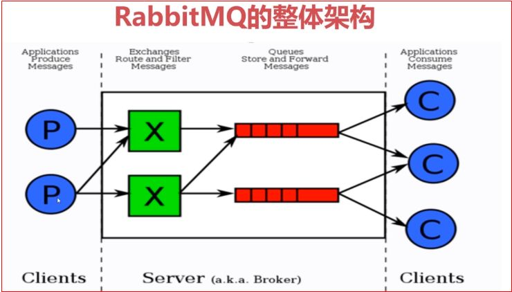

- 生产者只需要将消息发送到Exchange即可
- 消费者只需要监听对应的消息队列即可
- Exchange绑定多个Queue时, 要通过Routing Key进行路由

# RabbitMQ消息流转

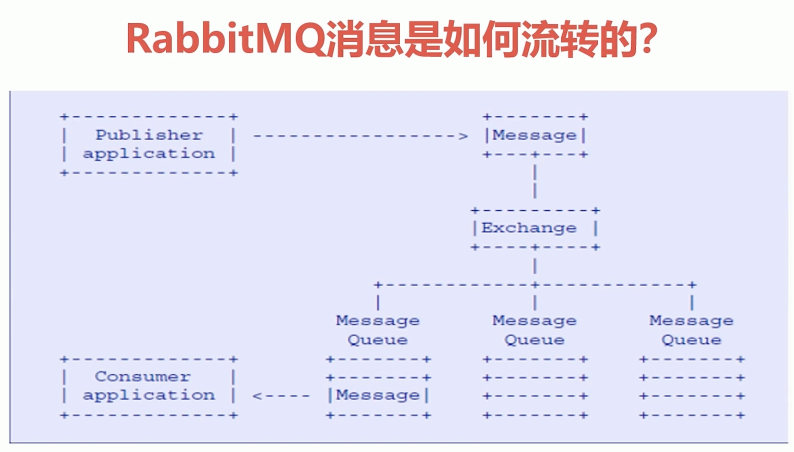

# RabbitMQ安装与使用

- **官网地址 :** http://www.rabbitmq.com/
- 需要安装Erlang安装包, 配置Erlang环境
- 需要安装Linux必须的一些依赖包
- 下载RabbitMQ必须的安装包
- 配置文件修改

### 安装步骤

1. 安装Erlang环境

   > wget www.rabbitmq.com/releases/erlang/erlang-18.3-1.el7.centos.x86_64.rpm
   >
   > yum install erlang-18.3-1.el7.centos.x86_64.rpm

2. 安装socat依赖

   > wget http://repo.iotti.biz/CentOS/7/x86_64/socat-1.7.3.2-5.el7.lux.x86_64.rpm
   >
   > yum install socat-1.7.3.2-5.el7.lux.x86_64.rpm

3. 安装RabbitMQ

   > wget www.rabbitmq.com/releases/rabbitmq-server/v3.6.5/rabbitmq-server-3.6.5-1.noarch.rpm
   >
   > yum install rabbitmq-server-3.6.5-1.noarch.rpm

4. 由于我的软件都安装在/usr/local/software目录下,所以我在这里建个软链接方便访问

   > ln -s /usr/lib/rabbitmq/lib/rabbitmq_server-3.6.5 /usr/local/software/rabbitmq

5. 修改配置文件

   > vim /usr/local/software/rabbitmq/ebin/rabbit.app

## RabbitMQ启动

- **服务的启动 :** rabbitmq-server start &

- **服务的停止 :** rabbitmqctl stop_app

- **管理插件 :** rabbitmq-plugins enable rabbitmq_management

  > 访问地址 : http://192.168.72.138:15672

## 命令行与管控台

- 关闭应用 : rabbitmqctl stop_app
- 启动应用 : rabbitmqctl start_app
- 节点状态 : rabbitmqctl status 

**用户相关 :**

- 添加用户 : rabbitmqctl add_user username password
- 列出所有用户 : rabbitmqctl list_users
- 删除用户 : rabbitmqctl delete_user username
- 清除用户权限 : rabbitmqctl clear_permissions -p vhostpath username
- 列出用户权限 : rabbitmqctl list_user_permissions username
- 修改密码 : rabbitmqctl change_password username newpassword
- 设置用户权限 : rabbitmqctl set_permissions -p vhostpath username

**虚拟主机相关 :**

- 创建虚拟主机 : rabbitmqctl add_vhost vhostpath
- 列出所有虚拟主机 : rabbitmqctl list_vhosts
- 列出虚拟主机上所有权限 : rabbitmqctl list_permissions -p vhostpath
- 删除虚拟主机 : rabbitmqctl delete_vhostpath

**队列相关 :** 

- 查看所有队列信息 : rabbitmqctl list_queues
- 清除队列里的消息 : rabbitmqctl -p vhostpath purge_queue blue

**高级操作(主要是集群相关) :**

- 移除所有数据 : rabbitmqctl reset, 要在rabbitmqctl stop_app之后使用过

- 组成集群命令 : rabbitmqctl join_cluster <clusternode> [--ram]

  > --ram表示指定数据存储模式, --ram表示数据存储到内存中

- 查看集群状态 : rabbitmqctl cluster_status

- 修改集群节点的存储形式 : rabbitmqctl change_cluster_node_type disc | ram

  > ram : 内存
  >
  > disc : 磁盘

- 忘记节点(移除节点) : rabbitmqctl forget_cluster_node [--offline]

  > offline表示可以在服务没启动时使用

- 修改节点名称 :  rabbitmqctl rename_cluster_node oldnode1 newnode1 oldnode2 new node2

# 快速入门

- ConnectionFactory : 获取连接工厂
- Connection : 一个连接
- Channel : 数据通信信道, 可发送和接收消息
- Queue : 具体的消息存储队列
- Producer & Consumer生产者和消费者

## 添加Maven依赖

```xml
<dependency>
            <groupId>com.rabbitmq</groupId>
            <artifactId>amqp-client</artifactId>
            <version>3.6.5</version>
        </dependency>
```

## 生产者代码

```java
package com.qiyexue.quickstart;

import com.rabbitmq.client.Channel;
import com.rabbitmq.client.Connection;
import com.rabbitmq.client.ConnectionFactory;

import java.io.IOException;
import java.util.concurrent.TimeoutException;

/**
 * 生产者
 *
 * @author 七夜雪
 * @create 2018-12-13 20:43
 */
public class Producer {

    public static void main(String[] args) throws Exception {
        // 1. 创建连接工厂, 设置属性
        ConnectionFactory factory = new ConnectionFactory();
        factory.setHost("192.168.72.138");
        factory.setPort(5672);
        factory.setVirtualHost("/");

        // 2. 创建连接
        Connection connection = factory.newConnection();

        // 3. 使用connection创建channel
        Channel channel = connection.createChannel();
        
        // 4. 通过channel发送消息
        String msg = "hello rabbitmq!";
        for (int i = 0; i < 5; i++) {
            // 不指定exchange的情况下, 使用默认的exchange, routingKey与队列名相等
            channel.basicPublish("", "test01", null, msg.getBytes());
        }

        // 5. 关闭连接
        channel.close();
        connection.close();
    }

}

```

## 消费者代码

```java
package com.qiyexue.quickstart;

import com.rabbitmq.client.Channel;
import com.rabbitmq.client.Connection;
import com.rabbitmq.client.ConnectionFactory;
import com.rabbitmq.client.QueueingConsumer;
import com.rabbitmq.client.QueueingConsumer.Delivery;
/**
 * 消费者
 *
 * @author 七夜雪
 * @create 2018-12-13 20:57
 */
public class Consumer {

    public static void main(String[] args) throws Exception {
        // 1. 创建连接工厂, 设置属性
        ConnectionFactory factory = new ConnectionFactory();
        factory.setHost("192.168.72.138");
        factory.setPort(5672);
        factory.setVirtualHost("/");

        // 2. 创建连接
        Connection connection = factory.newConnection();

        // 3. 使用connection创建channel
        Channel channel = connection.createChannel();

        // 4. 声明(创建)一个队列
        String queueName = "test01";
        channel.queueDeclare(queueName,true, false, false, null);

        // 5. 创建消费者
        QueueingConsumer consumer = new QueueingConsumer(channel);

        // 6. 设置channel
        channel.basicConsume(queueName, true, consumer);
        while (true) {
            // 7. 获取消息
            Delivery delivery = consumer.nextDelivery();
            System.err.println(new String(delivery.getBody()));
        }
        
    }

}
```

# Exchange 交换机

- Exchange : 接收消息, 并根据路由键转发消息所绑定的队列

  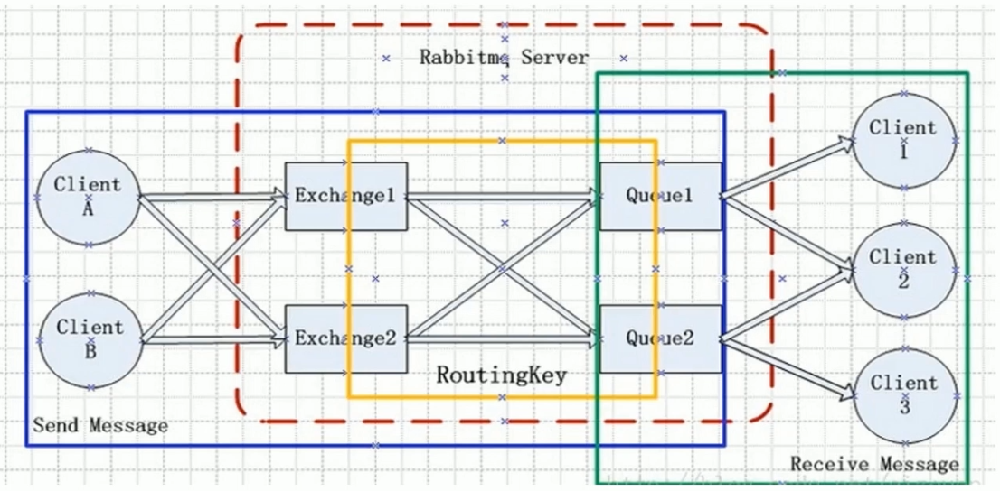

## 交换机属性

- Name : 交换机名称

- Type : 交换机类型, direct, topic, fanout, headers

- Durability : 是否需要持久化, true为持久化

- Auto Delete : 当最后一个绑定到Exchange上的队列删除后, 自动删除该Exchange

- Internal : 当前Exchange是否用于RabbitMQ内部使用, 默认为False, 这个属性很少会用到

- Arguments : 扩展参数, 用于扩展AMQP协议制定化使用

## Direct Exchange

- Direct Exchange : 所有发送到Direct Exchange的消息被转发到RoutingKey中指定的Queue

  > **注意 :** Direct模式可以使用RabbitMQ自带的Exchange(default Exchange), 所以不需要将Exchange进行任何绑定(binding)操作, 消息传递时, RoutingKey必须完全匹配才会被队列接收, 否则该消息会被抛弃
  >
  > 

### Producer

```java
package com.qiyexue.exchange.direct;

import com.rabbitmq.client.Channel;
import com.rabbitmq.client.Connection;
import com.rabbitmq.client.ConnectionFactory;

import java.io.IOException;
import java.util.concurrent.TimeoutException;

/**
 * Direct模式的生产者
 *
 * @author 七夜雪
 * @create 2018-12-13 22:00
 */
public class ProducerByDirect {

    public static void main(String[] args) throws IOException, TimeoutException {
        // 1. 创建连接工厂, 设置属性
        ConnectionFactory factory = new ConnectionFactory();
        factory.setHost("192.168.72.138");
        factory.setPort(5672);
        factory.setVirtualHost("/");

        // 2. 获取连接
        Connection connection = factory.newConnection();

        // 3. 创建channel
        Channel channel = connection.createChannel();

        // 4. 声明
        String exchangeName = "test_direct_exchange";
        // Direct模式必须和消费者保持一致才能发送消息, 不然消息会被丢弃
        String routingKey = "test.direct";

        // 5. 发送消息
        String msg = "Hello RabbitMQ By Direct";
        channel.basicPublish(exchangeName, routingKey, null, msg.getBytes());

        // 6. 关闭连接
        channel.close();
        connection.close();
    }

}

```

### Consumer

```java
package com.qiyexue.exchange.direct;

import com.rabbitmq.client.Channel;
import com.rabbitmq.client.Connection;
import com.rabbitmq.client.ConnectionFactory;
import com.rabbitmq.client.QueueingConsumer;

import java.io.IOException;
import java.util.concurrent.TimeoutException;

/**
 * Direct模式消费者
 *
 * @author 七夜雪
 * @create 2018-12-13 22:01
 */
public class ConsumerByDirect {

    public static void main(String[] args) throws Exception {
        // 1. 创建工厂
        ConnectionFactory factory = new ConnectionFactory();
        factory.setHost("192.168.72.138");
        factory.setPort(5672);
        factory.setVirtualHost("/");

        // 2. 获取连接
        Connection connection = factory.newConnection();

        // 3. 创建channel
        Channel channel = connection.createChannel();

        // 4. 声明
        // 交换机名称
        String exchangeName = "test_direct_exchange";
        // 交换机类型
        String exchangeType = "direct";
        String queueName = "test_direct_queue";
        // Direct模式RoutingKey必须和生产者保持一致才能消费
        String routingKey = "test.direct";
        // 表示声明了一个交换机, 后面几个参数分别为durable, autoDelete, internal, arguments
        channel.exchangeDeclare(exchangeName, exchangeType, true, false, false, null);
        // 声明一个队列, 后面四个参数分别为durable, exclusive, autoDelete, arguments
        // durable : 是否持久化消息
        channel.queueDeclare(queueName, false, false, false, null);
        // 建立一个绑定关系
        channel.queueBind(queueName, exchangeName, routingKey);

        QueueingConsumer consumer = new QueueingConsumer(channel);
        // 参数 : 队列名称, autoAck:是否自动确认, consumer
        channel.basicConsume(queueName, true, consumer);
        while (true) {
            QueueingConsumer.Delivery delivery = consumer.nextDelivery();
            String msg = new String(delivery.getBody());
            System.out.println("收到消息 : " + msg);
        }
    }

}
```


## Topic Exchange

- 所有发送到Topic Exchange的消息将被转发到所有关心RoutingKey中指定Topic的Queue上

- Exchange将RoutingKey和某个Topic进行模糊匹配, 此时队列需要绑定一个Topic

  > - 可以使用通配符进行模糊匹配
  > - "#" : 匹配一个或多个词
  > - "*" : 匹配一个词
  >
  > 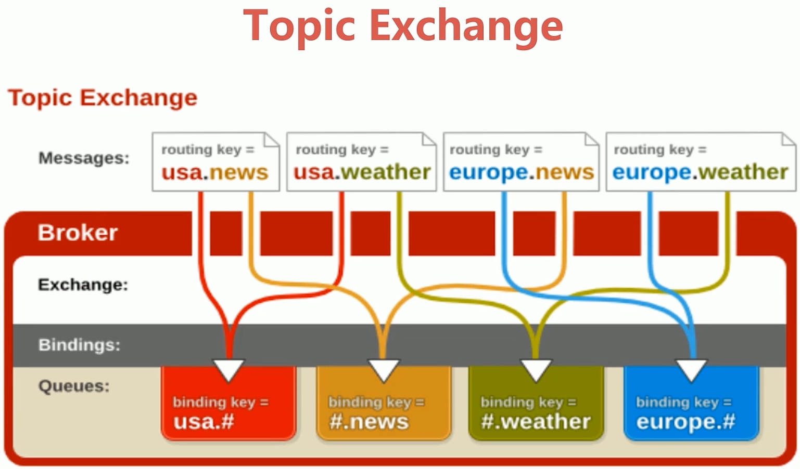

### Producer

```java
package com.qiyexue.exchange.topic;

import com.rabbitmq.client.Channel;
import com.rabbitmq.client.Connection;
import com.rabbitmq.client.ConnectionFactory;

import java.io.IOException;
import java.util.concurrent.TimeoutException;

/**
 * Topic模式生产者
 *
 * @author 七夜雪
 * @create 2018-12-14 8:07
 */
public class ProducerByTopic {

    public static void main(String[] args) throws IOException, TimeoutException {
        // 创建工厂
        ConnectionFactory factory = new ConnectionFactory();
        factory.setHost("192.168.72.138");
        factory.setPort(5672);
        factory.setVirtualHost("/");

        // 创建连接
        Connection connection = factory.newConnection();

        // 创建channel
        Channel channel = connection.createChannel();

        // 声明
        String exchangeName = "test_topic_exchange";
        String routingKey1 = "tingxuelou.biluo";
        String routingKey2 = "tingxuelou.hongchen";
        String routingKey3 = "tingxuelou.hufa.zimo";

        String msg = "test topic By routingKey : ";
        channel.basicPublish(exchangeName, routingKey1, null, (msg + routingKey1).getBytes());
        channel.basicPublish(exchangeName, routingKey2, null, (msg + routingKey2).getBytes());
        channel.basicPublish(exchangeName, routingKey3, null, (msg + routingKey3).getBytes());

        // 关闭连接
        channel.close();
        connection.close();

    }

}

```

### Consumer

```java
package com.qiyexue.exchange.topic;

import com.rabbitmq.client.Channel;
import com.rabbitmq.client.Connection;
import com.rabbitmq.client.ConnectionFactory;
import com.rabbitmq.client.QueueingConsumer;

/**
 * topic模式消费者
 *
 * @author 七夜雪
 * @create 2018-12-14 20:10
 */
public class ConsumerByTopic {

    public static void main(String[] args) throws Exception {
        // 创建工厂
        // 创建工厂
        ConnectionFactory factory = new ConnectionFactory();
        factory.setHost("192.168.72.138");
        factory.setPort(5672);
        factory.setVirtualHost("/");

        // 创建连接
        Connection connection = factory.newConnection();

        // 创建channel
        Channel channel = connection.createChannel();

        // 声明Exchange
        String exchangeName = "test_topic_exchange";
        String exchangetype = "topic";
        // tingxuelou.#
        String routingKey = "tingxuelou.*";
        channel.exchangeDeclare(exchangeName, exchangetype);

        // 声明队列
        String queueName = "test_topic_queue";
        channel.queueDeclare(queueName, false, false, false, null);

        // 绑定队列
        channel.queueBind(queueName, exchangeName, routingKey);

        // 创建消费者
        QueueingConsumer consumer = new QueueingConsumer(channel);
        channel.basicConsume(queueName, true, consumer);

        while (true) {
            QueueingConsumer.Delivery delivery = consumer.nextDelivery();
            System.out.println(new String(delivery.getBody()));
        }
    }

}

```

## Fanout Exchange

- 不处理路由键, 只需要简单的将队列绑定到交换机上

- 发送到交换机的消息都会被转发到与该交换机绑定的所有队列上

- Fanout交换机转发消息是最快的

  > 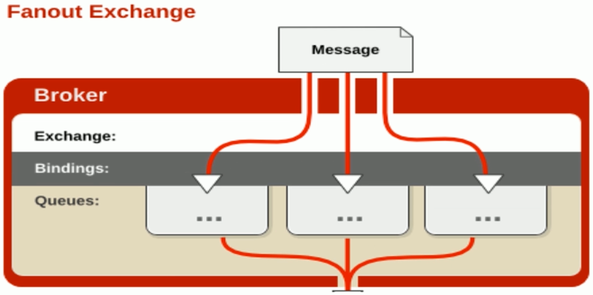

### Producer

```java
package com.qiyexue.exchange.fanout;

import com.rabbitmq.client.Channel;
import com.rabbitmq.client.Connection;
import com.rabbitmq.client.ConnectionFactory;

/**
 * fanout模式生产者
 *
 * @author 七夜雪
 * @create 2018-12-14 20:36
 */
public class ProducerByFanout {

    public static void main(String[] args) throws Exception {
        // 1. 创建连接工厂, 设置属性
        ConnectionFactory factory = new ConnectionFactory();
        factory.setHost("192.168.72.138");
        factory.setPort(5672);
        factory.setVirtualHost("/");

        // 2. 获取连接
        Connection connection = factory.newConnection();

        // 3. 创建channel
        Channel channel = connection.createChannel();

        String exchangeName = "test_fanout_exchange";
        String routingKey = "无所谓";
        for (int i = 0; i < 5; i++) {
            String msg = "Fanout 模式消息..";
            channel.basicPublish(exchangeName, routingKey, null, msg.getBytes());
        }

        // 关闭连接
        channel.close();
        connection.close();
    }

}
```

### Consumer

```java
package com.qiyexue.exchange.fanout;

import com.rabbitmq.client.Channel;
import com.rabbitmq.client.Connection;
import com.rabbitmq.client.ConnectionFactory;
import com.rabbitmq.client.QueueingConsumer;

/**
 * Fanout模式消费者
 *
 * @author 七夜雪
 * @create 2018-12-14 20:40
 */
public class ConsumerByFanout {

    public static void main(String[] args) throws Exception {
        // 1. 创建连接工厂, 设置属性
        ConnectionFactory factory = new ConnectionFactory();
        factory.setHost("192.168.72.138");
        factory.setPort(5672);
        factory.setVirtualHost("/");

        // 2. 获取连接
        Connection connection = factory.newConnection();

        // 3. 创建channel
        Channel channel = connection.createChannel();

        // 4. 声明Exchange
        String exchangeName = "test_fanout_exchange";
        String exchangeType = "fanout";
        channel.exchangeDeclare(exchangeName, exchangeType);

        // 5. 声明消息队列
        String routingKey = "";
        String queueName = "test_fanout_queue";
        channel.queueDeclare(queueName, false, false, false, null);
        channel.queueBind(queueName, exchangeName, routingKey);

        // 6. 创建消费者
        QueueingConsumer consumer = new QueueingConsumer(channel);
        channel.basicConsume(queueName, true, consumer);

        while (true) {
            QueueingConsumer.Delivery delivery = consumer.nextDelivery();
            String msg = new String(delivery.getBody());
            System.out.println("收到消息 : " + msg);
        }

    }

}
```

## Headers Exchange

- Headers Exchange不使用RoutingKey去绑定, 而是通过消息headers的键值对匹配
- 这个Exchange很少会使用, 这里就不细说了

# Binding-绑定

- Exchange和Exchange, Queue之间的连接关系
- 绑定中可以包含RoutingKey或者参数

# Queue-消息队列

- 消息队列, 实际存储消息数据

- Durability : 是否持久化

  > Durable : 是
  >
  > Transient : 否

- Auto delete : 如选yes,代表当最后一个监听被移除之后, 该Queue会自动被删除

# Message-消息

- 服务和应用程序之间传送的数据

- 本质上就是一段数据, 由Properties和Payload(Body)组成
- 常用属性 : delivery mode, headers(自定义属性)

## Message-其他属性

- content_type, content_encoding, priority
- correlation_id : 可以认为是消息的唯一id
- replay_to : 重回队列设定
- expiration : 消息过期时间
- message_id : 消息id
- timestamp, type, user_id, app_id, cluster_id

## 代码演示

### Producer

```java
package com.qiyexue.message;

import com.rabbitmq.client.AMQP;
import com.rabbitmq.client.Channel;
import com.rabbitmq.client.Connection;
import com.rabbitmq.client.ConnectionFactory;

import java.util.HashMap;
import java.util.Map;

/**
 * 生产者
 *
 * @author 七夜雪
 * @create 2018-12-13 20:43
 */
public class Producer {

    public static void main(String[] args) throws Exception {
        // 1. 创建连接工厂, 设置属性
        ConnectionFactory factory = new ConnectionFactory();
        factory.setHost("192.168.72.138");
        factory.setPort(5672);
        factory.setVirtualHost("/");

        // 2. 创建连接
        Connection connection = factory.newConnection();

        // 3. 使用connection创建channel
        Channel channel = connection.createChannel();

        // 4. 通过channel发送消息
        String msg = "hello rabbitmq!";
        AMQP.BasicProperties properties = new AMQP.BasicProperties();
        Map<String,Object> headers = new HashMap<String, Object>();
        headers.put("name", "七夜雪");
        properties = properties.builder()
                // 设置编码为UTF8
                .contentEncoding("UTF-8")
                // 设置自定义Header
                .headers(headers)
                // 设置消息失效时间
                .expiration("5000").build();

        for (int i = 0; i < 5; i++) {
            // 不指定exchange的情况下, 使用默认的exchange, routingKey与队列名相等
            channel.basicPublish("", "test01", properties, msg.getBytes());
        }

        // 5. 关闭连接
        channel.close();
        connection.close();
    }

}
```

### Consumer

```java
package com.qiyexue.message;

import com.rabbitmq.client.Channel;
import com.rabbitmq.client.Connection;
import com.rabbitmq.client.ConnectionFactory;
import com.rabbitmq.client.QueueingConsumer;
import com.rabbitmq.client.QueueingConsumer.Delivery;

/**
 * 消费者
 *
 * @author 七夜雪
 * @create 2018-12-13 20:57
 */
public class Consumer {

    public static void main(String[] args) throws Exception {
        // 1. 创建连接工厂, 设置属性
        ConnectionFactory factory = new ConnectionFactory();
        factory.setHost("192.168.72.138");
        factory.setPort(5672);
        factory.setVirtualHost("/");

        // 2. 创建连接
        Connection connection = factory.newConnection();

        // 3. 使用connection创建channel
        Channel channel = connection.createChannel();

        // 4. 声明(创建)一个队列
        String queueName = "test01";
        channel.queueDeclare(queueName,true, false, false, null);

        // 5. 创建消费者
        QueueingConsumer consumer = new QueueingConsumer(channel);

        // 6. 设置channel
        channel.basicConsume(queueName, true, consumer);
        while (true) {
            // 7. 获取消息
            Delivery delivery = consumer.nextDelivery();
            System.out.println(new String(delivery.getBody()));
            // 获取head中内容
            System.out.println(delivery.getProperties().getHeaders().get("name"));
        }
        
    }

}
```

# Virtual Host-虚拟主机

- 虚拟地址, 用于进行逻辑隔离, 最上层的消息路由
- 一个Virtual Host里面可以有若干个Exchange和Queue
- 同一个Virtual Host里面不能有相同名称的Exchange或Queue

# RabbitMQ高级特性

## 消息如何保障100%的投递成功

### 什么是生产端的可靠性投递

- 保障消息的成功发出
- 保障MQ节点的成功接收
- 发送端收到MQ节点(Broker)的确认应答
- 完善的消息补偿机制

### 可靠性投递的解决方案

- 消息落库, 对消息状态进行标记

  > - 将消息落入数据库中, 对消息状态进行标记, 消息状态发生变更时, 更新标记信息
  > - 对失败消息进行轮询重发, 设置轮询次数
  >
  > 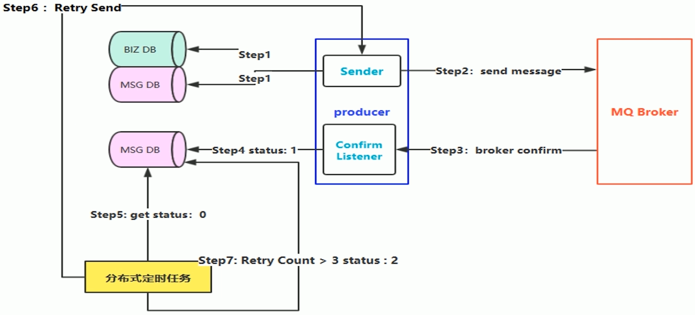

- 消息的延迟投递, 做二次确认, 回调检查

  > 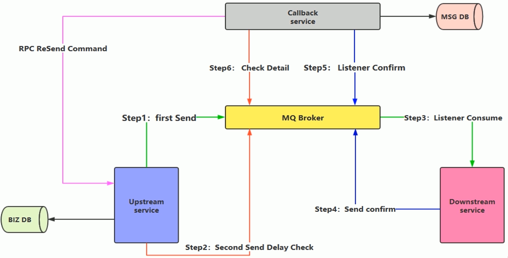
  >
  > 1. step1 : 第一次消息发送, 必须业务数据落库之后才能进行消息发送
  > 2. step2 : 第二次消息延迟发送, 设定延迟一段时间发送第二次check消息 
  > 3. step3 : 消费端监听Broker, 进行消息消费
  > 4. step4 : 消费成功之后, 发送确认消息到确认消息队列
  > 5. step5 : Callback Service监听step4中的确认消息队列, 维护消息状态, 是否消费成功等状态
  > 6. step6 : Callback Service监听step2发送的Delay Check的消息队列, 检测内部的消息状态, 如果消息是发送成功状态, 则流程结束, 如果消息是失败状态, 或者查不到当前消息状态时, 会通知生产者, 进行消息重发, 重新上述步骤


## 消费端-幂等性保障

- 幂等性 : 多次执行, 结果保持一致

### 主流的幂等性操作

- 唯一ID + 指纹码机制, 利用数据库主键去重

  > - 好处 : 实现简单
  > - 坏处 : 高并发下有数据库写入的性能瓶颈
  > - 解决方案 : 根据ID进行分库分表进行算法路由

- 利用Redis的原子性实现

  > 需要关注的问题:
  >
  > - 是否要进行数据落库, 如果落库的话, 数据库和缓存如何做到原子性
  > - 如果不落库, 数据都存储到缓存中, 如何设置定时同步的策略

## Confirm确认消息

- 消息的确认, 是指生产者投递消息后, 如果Broker收到消息, 则会给我们产生一个应答

- 生产者进行接收应答, 用来确定这条消息是否正常发送到Broker, 这种方式也是消息的可靠性投递的核心保障

  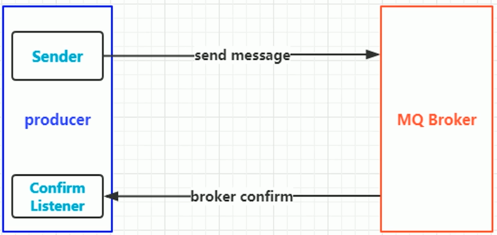

### 如何实现Confirm确认消息

1. 在channel上开启确认模式 : channel.confirmSelect()
2. 在channel上添加监听 : addConfirmListener, 监听成功和失败的返回结果, 根据具体的结果对消息进行重新发送, 或记录日志等后续处理

#### Producer代码

```java
package com.qiyexue.confirm;

import com.rabbitmq.client.Channel;
import com.rabbitmq.client.ConfirmListener;
import com.rabbitmq.client.Connection;
import com.rabbitmq.client.ConnectionFactory;

import java.io.IOException;

/**
 * Confirm确认消息模式生产者
 *
 * @author 七夜雪
 * @create 2018-12-15 16:12
 */
public class ProducerByConfirm {

    public static void main(String[] args) throws Exception {
        // 1. 创建ConnectionFactory, 并设置属性
        ConnectionFactory factory = new ConnectionFactory();
        factory.setHost("192.168.72.138");
        factory.setPort(5672);
        factory.setVirtualHost("/");

        // 2. 创建连接
        Connection connection = factory.newConnection();

        // 3. 创建channel
        Channel channel = connection.createChannel();

        // 4. 开启Confirm模式
        channel.confirmSelect();

        String exchangeName = "test_confirm_exchange";
        String routingKey = "confirm.qiye";

        // 5. 发送消息
        String msg = "Send Msg By Confirm ...";
        channel.basicPublish(exchangeName, routingKey, null, msg.getBytes());

        // 6. 设置监听
        channel.addConfirmListener(new ConfirmListener() {
            public void handleAck(long deliveryTag, boolean multiple) throws IOException {
                System.out.println("-------ACK Success--------");
            }

            public void handleNack(long deliveryTag, boolean multiple) throws IOException {
                System.err.println("-------ACK Failed--------");
            }
        });

        // 因为设置了监听, 这里就不关闭channel和connection了
    }

}
```

#### Consumer代码

```java
package com.qiyexue.confirm;

import com.rabbitmq.client.Channel;
import com.rabbitmq.client.Connection;
import com.rabbitmq.client.ConnectionFactory;
import com.rabbitmq.client.QueueingConsumer;

/**
 * Confirm消息确认的生产者
 *
 * @author 七夜雪
 * @create 2018-12-15 16:19
 */
public class ConsumerByConfirm {

    public static void main(String[] args) throws Exception {
        // 1. 创建连接工厂并设置属性
        ConnectionFactory factory = new ConnectionFactory();;
        factory.setHost("192.168.72.138");
        factory.setPort(5672);
        factory.setVirtualHost("/");

        // 2. 创建连接
        Connection connection = factory.newConnection();

        // 3. 创建channel
        Channel channel = connection.createChannel();

        // 4. 声明Exchange
        String exchangeName = "test_confirm_exchange";
        String exchangeType = "topic";
        String routingKey = "confirm.*";
        channel.exchangeDeclare(exchangeName, exchangeType, true, false, null);

        // 5. 声明消息队列
        String queueName = "test_confirm_queue";
        channel.queueDeclare(queueName, true, false, false, null);

        // 6. 绑定队列和Exchange
        channel.queueBind(queueName, exchangeName, routingKey);

        // 7. 创建一个消费者
        QueueingConsumer consumer = new QueueingConsumer(channel);

        // 8. 设置消费者从哪个队列开始消费, 设置自动ACK
        channel.basicConsume(queueName, true, consumer);

        while (true) {
            QueueingConsumer.Delivery delivery = consumer.nextDelivery();
            String msg = new String(delivery.getBody());
            System.out.println(msg);
        }

    }

}
```

## Return消息机制

- Return Listener用于处理一些不可路由的消息

- 正常情况下消息生产者通过指定一个Exchange和RoutingKey, 把消息送到某一个队列中去, 然后消费者监听队列, 进行消费

- 但在某些情况下, 如果在发送消息的时候, 当前的exchange不存在或者指定的路由key路由不到, 这个时候如果我们需要监听这种不可达的消息, 就要使用Return Listener

- 在基础API中有一个关键的配置项Mandatory  : 如果为true, 则监听器会接收到路由不可达的消息, 然后进行后续处理, 如果为false, 那么broker端自动删除该消息

  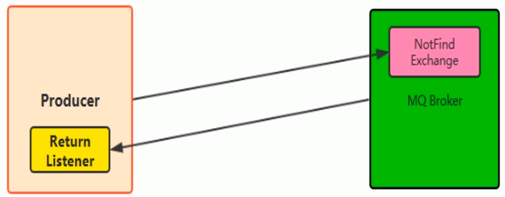

### 代码演示

#### Producer

```java
package com.qiyexue.returnlistener;

import com.rabbitmq.client.*;

import java.io.IOException;

/**
 * Return Listener模式生产者
 *
 * @author 七夜雪
 * @create 2018-12-15 19:56
 */
public class Producer {

    public static void main(String[] args) throws Exception {
        // 1. 创建ConnectionFactory, 并设置属性
        ConnectionFactory factory = new ConnectionFactory();
        factory.setHost("192.168.72.138");
        factory.setPort(5672);
        factory.setVirtualHost("/");

        // 2. 创建连接
        Connection connection = factory.newConnection();

        // 3. 创建channel
        Channel channel = connection.createChannel();

        // 4. 设置Return Listener监听
        channel.addReturnListener(new ReturnListener() {
            public void handleReturn(int replyCode, String replyText, String exchange, String routingKey, AMQP.BasicProperties properties, byte[] body) throws IOException {
                System.out.println("--------------Return Listener--------------");
                System.out.println(replyCode);
                System.out.println(replyText);
                System.out.println(exchange);
                System.out.println(routingKey);
                System.out.println(properties);
                System.out.println(new String(body));
            }
        });

        String exchangeName = "test_return_exchange";
        String routingKey = "return.qiye";
        String routingErrorKey = "error.qiye";

        // 发送消息
        String msg = "Send Msg And Return Listener By RoutingKey : ";
        channel.basicPublish(exchangeName, routingKey, true, null, (msg + routingKey).getBytes());
        channel.basicPublish(exchangeName, routingErrorKey,true, null, (msg + routingErrorKey).getBytes());

    }

}
```

#### Consumer

```java
package com.qiyexue.returnlistener;

import com.rabbitmq.client.Channel;
import com.rabbitmq.client.Connection;
import com.rabbitmq.client.ConnectionFactory;
import com.rabbitmq.client.QueueingConsumer;

/**
 * Return Listener模式消费者
 *
 * @author 七夜雪
 * @create 2018-12-15 20:07
 */
public class Consumer {

    public static void main(String[] args) throws Exception {
        // 1. 创建连接工厂并设置属性
        ConnectionFactory factory = new ConnectionFactory();;
        factory.setHost("192.168.72.138");
        factory.setPort(5672);
        factory.setVirtualHost("/");

        // 2. 创建连接
        Connection connection = factory.newConnection();

        // 3. 创建channel
        Channel channel = connection.createChannel();

        // 4. 声明Exchange
        String exchangeName = "test_return_exchange";
        String exchangeType = "topic";
        String routingKey = "return.*";
        channel.exchangeDeclare(exchangeName, exchangeType, true, false, null);

        // 5. 声明消息队列
        String queueName = "test_return_queue";
        channel.queueDeclare(queueName, true, false, false, null);

        // 6. 绑定队列和Exchange
        channel.queueBind(queueName, exchangeName, routingKey);

        // 7. 创建一个消费者
        QueueingConsumer consumer = new QueueingConsumer(channel);

        // 8. 设置消费者从哪个队列开始消费, 设置自动ACK
        channel.basicConsume(queueName, true, consumer);

        while (true) {
            QueueingConsumer.Delivery delivery = consumer.nextDelivery();
            String msg = new String(delivery.getBody());
            System.out.println(msg);
        }

    }

}
```

## 消费端自定义监听

- 在之前的代码演示中, consumer进行消费时 ,都是使用while循环进行消息消费, 然后使用consumer.nextDelivery()方法获取下一条消息
- 但是在实际工作中, 使用自定义的Consumer更加的方便, 解耦性也更加的强, 实现自定义的Consumer可以实现Consumer接口, 或者更常用的是继承默认的DefaultConsumer

### 代码演示

#### 自定义消费者(替换QueueingConsumer)

```java
package com.qiyexue.api.consumer;

import com.rabbitmq.client.AMQP;
import com.rabbitmq.client.Channel;
import com.rabbitmq.client.DefaultConsumer;
import com.rabbitmq.client.Envelope;

import java.io.IOException;

/**
 * 自定义消费者
 * @author 七夜雪
 * @create 2018-12-16 8:20
 */
public class MyConsumer extends DefaultConsumer {

    public MyConsumer(Channel channel) {
        super(channel);
    }

    @Override
    public void handleDelivery(String consumerTag, Envelope envelope, AMQP.BasicProperties properties, byte[] body) throws IOException {
        System.out.println("-------------自定义消费者------------");
        System.out.println("consumerTag : " + consumerTag);
        System.out.println("envelope : " + envelope);
        System.out.println("properties : " + properties);
        System.out.println("body : " + new String(body));
    }
}
```

#### Producer

```java
package com.qiyexue.api.consumer;

import com.rabbitmq.client.*;

import java.io.IOException;

/**
 * 生产者
 *
 * @author 七夜雪
 * @create 2018-12-15 19:56
 */
public class Producer {

    public static void main(String[] args) throws Exception {
        // 1. 创建ConnectionFactory, 并设置属性
        ConnectionFactory factory = new ConnectionFactory();
        factory.setHost("192.168.72.138");
        factory.setPort(5672);
        factory.setVirtualHost("/");

        // 2. 创建连接
        Connection connection = factory.newConnection();

        // 3. 创建channel
        Channel channel = connection.createChannel();


        String exchangeName = "test_consumer_exchange";
        String routingKey = "consumer.qiye";

        // 发送消息
        String msg = "自定义消费者, 消息发送 : Hello, 七夜雪";
        channel.basicPublish(exchangeName, routingKey, true, null, msg.getBytes());

        // 关闭连接
        channel.close();
        connection.close();

    }

}
```

#### Consumer

```java
package com.qiyexue.api.consumer;

import com.rabbitmq.client.Channel;
import com.rabbitmq.client.Connection;
import com.rabbitmq.client.ConnectionFactory;
import com.rabbitmq.client.QueueingConsumer;

/**
 * Return Listener模式消费者
 *
 * @author 七夜雪
 * @create 2018-12-15 20:07
 */
public class Consumer {

    public static void main(String[] args) throws Exception {
        // 1. 创建连接工厂并设置属性
        ConnectionFactory factory = new ConnectionFactory();;
        factory.setHost("192.168.72.138");
        factory.setPort(5672);
        factory.setVirtualHost("/");

        // 2. 创建连接
        Connection connection = factory.newConnection();

        // 3. 创建channel
        Channel channel = connection.createChannel();

        // 4. 声明Exchange
        String exchangeName = "test_consumer_exchange";
        String exchangeType = "topic";
        String routingKey = "consumer.*";
        channel.exchangeDeclare(exchangeName, exchangeType, true, false, null);

        // 5. 声明消息队列
        String queueName = "test_consumer_queue";
        channel.queueDeclare(queueName, true, false, false, null);

        // 6. 绑定队列和Exchange
        channel.queueBind(queueName, exchangeName, routingKey);

        // 7. 设置消费者为自定义的消费者
        channel.basicConsume(queueName, true, new MyConsumer(channel));

    }

}
```

## 消费端限流

- 消息队列中囤积了大量的消息, 或者某些时刻生产的消息远远大于消费者处理能力的时候, 这个时候如果消费者一次取出大量的消息, 但是客户端又无法处理, 就会出现问题, 甚至可能导致服务崩溃, 所以需要对消费端进行限流

- RabbitMQ提供了一种qos(服务质量保证)功能, 即在飞自动确认消息的前提下, 如果一定数目的消息(通过consumer或者channel设置qos的值)未被确认前, 不进行消费新的消息

  > - 自动签收要设置成false, 建议实际工作中也设置成false
  > - void basicQos(int prefetchSize, int prefetchCount, boolean global) throws IOException;
  > - prefetchSize : 消息大小限制, 一般设置为0, 消费端不做限制
  > - prefetchCount : 会告诉RabbitMQ不要同时给一个消费者推送多于N个消息, 即一旦有N个消息还没有ack, 则该consumer将block(阻塞), 直到有消息ack
  > - global : true/false 是否将上面设置应用于channel, 简单来说就是上面的限制是channel级别的还是consumer级别
  >
  > **注意 :** 
  >
  > - prefetchSize和global这两项, RabbitMQ没有实现, 暂且不关注, prefetchCount在autoAck设置false的情况下生效, 即在自动确认的情况下这两个值是不生效的

### 代码演示

#### 自定义消费者, 设置手动签收消息

```java
package com.qiyexue.api.limit;

import com.rabbitmq.client.AMQP;
import com.rabbitmq.client.Channel;
import com.rabbitmq.client.DefaultConsumer;
import com.rabbitmq.client.Envelope;

import java.io.IOException;

/**
 * 自定义消费者
 * @author 七夜雪
 * @date 2018-12-16 8:20
 */
public class MyConsumer extends DefaultConsumer {

    private Channel channel;

    public MyConsumer(Channel channel) {
        super(channel);
        this.channel = channel;
    }

    @Override
    public void handleDelivery(String consumerTag, Envelope envelope, AMQP.BasicProperties properties, byte[] body) throws IOException {
        System.out.println("-------------自定义消费者------------");
        System.out.println("consumerTag : " + consumerTag);
        System.out.println("envelope : " + envelope);
        System.out.println("properties : " + properties);
        System.out.println("body : " + new String(body));
        // 第二个参数表示是否批量签收
        channel.basicAck(envelope.getDeliveryTag(), false);
    }
}
```

#### Producer

```java
package com.qiyexue.api.limit;

import com.rabbitmq.client.Channel;
import com.rabbitmq.client.Connection;
import com.rabbitmq.client.ConnectionFactory;

/**
 * 生产者
 *
 * @author 七夜雪
 * @date 2018-12-15 19:56
 */
public class Producer {

    public static void main(String[] args) throws Exception {
        // 1. 创建ConnectionFactory, 并设置属性
        ConnectionFactory factory = new ConnectionFactory();
        factory.setHost("192.168.72.138");
        factory.setPort(5672);
        factory.setVirtualHost("/");

        // 2. 创建连接
        Connection connection = factory.newConnection();

        // 3. 创建channel
        Channel channel = connection.createChannel();


        String exchangeName = "test_limit_exchange";
        String routingKey = "limit.qiye";

        // 发送消息
        String msg = "自定义消费者, 消息发送 : Hello, 七夜雪";
        for (int i = 0; i < 5; i++) {
            channel.basicPublish(exchangeName, routingKey, true, null, msg.getBytes());
        }

        // 关闭连接
        channel.close();
        connection.close();

    }

}
```

**Consumer设置Qos, 关闭自动签收**

```java
package com.qiyexue.api.limit;

import com.rabbitmq.client.Channel;
import com.rabbitmq.client.Connection;
import com.rabbitmq.client.ConnectionFactory;

/**
 * 消费者
 *
 * @author 七夜雪
 * @date 2018-12-15 20:07
 */
public class Consumer {

    public static void main(String[] args) throws Exception {
        // 1. 创建连接工厂并设置属性
        ConnectionFactory factory = new ConnectionFactory();
        factory.setHost("192.168.72.138");
        factory.setPort(5672);
        factory.setVirtualHost("/");

        // 2. 创建连接
        Connection connection = factory.newConnection();

        // 3. 创建channel
        Channel channel = connection.createChannel();

        // 4. 声明Exchange
        String exchangeName = "test_limit_exchange";
        String exchangeType = "topic";
        String routingKey = "limit.*";
        channel.exchangeDeclare(exchangeName, exchangeType, true, false, null);

        // 5. 声明消息队列
        String queueName = "test_limit_queue";
        channel.queueDeclare(queueName, true, false, false, null);

        // 6. 绑定队列和Exchange
        channel.queueBind(queueName, exchangeName, routingKey);

        // 表示不限制消息大小, 一次只处理一条消息, 限制只是当前消费者有效
        channel.basicQos(0, 1, false);

        // 7. 设置消费者为自定义的消费者, 要进行限流必须关闭自动签收
        channel.basicConsume(queueName, false, new MyConsumer(channel));

    }

}
```

## 消费端ACK与重回队列

### 消费端ACK

- 消费端的手工ACK和NACK, ACK是确认成功消费, NACK表示消息处理失败, 会重发消息
- 消费端进行消费的时候, 如果由于业务异常我们可以进行日志的记录, 然后进行补偿
- 如果由于服务器宕机等严重问题, 就需要手工进行ACK保障消费端消费成功

### 重回队列

- 消费端重回队列是为了对没有处理成功的消息, 把消息重新回递给Broker
- 一般在实际应用中, 都会关闭重回队列, 也就是设置为False

### 代码演示

#### 自定义消费者

```java
package com.qiyexue.api.ack;

import com.rabbitmq.client.AMQP;
import com.rabbitmq.client.Channel;
import com.rabbitmq.client.DefaultConsumer;
import com.rabbitmq.client.Envelope;

import java.io.IOException;
import java.util.concurrent.TimeUnit;

/**
 * 自定义消费者
 * 设置手动ack和重回队列
 * @author 七夜雪
 * @date 2018-12-16 8:20
 */
public class MyConsumer extends DefaultConsumer {
    private Channel channel;

    public MyConsumer(Channel channel) {
        super(channel);
        this.channel = channel;
    }

    @Override
    public void handleDelivery(String consumerTag, Envelope envelope, AMQP.BasicProperties properties, byte[] body) throws IOException {
        System.out.println("-------------自定义消费者------------");
        System.out.println("consumerTag : " + consumerTag);
        System.out.println("envelope : " + envelope);
        System.out.println("properties : " + properties);
        System.out.println("body : " + new String(body));
        try {
            TimeUnit.SECONDS.sleep(2);
        } catch (InterruptedException e) {
            e.printStackTrace();
        }

        if ((Integer)properties.getHeaders().get("num") == 0) {
            // 三个参数 : DeliveryTag, 是否批量拒绝, 是否可以重回队列
            channel.basicNack(envelope.getDeliveryTag(), false, true);
        } else {
            channel.basicAck(envelope.getDeliveryTag(), false);
        }

    }
}
```

#### Producer

```java
package com.qiyexue.api.ack;

import com.rabbitmq.client.*;

import java.util.HashMap;
import java.util.Map;

/**
 * 生产者
 *
 * @author 七夜雪
 * @date 2018-12-15 19:56
 */
public class Producer {

    public static void main(String[] args) throws Exception {
        // 1. 创建ConnectionFactory, 并设置属性
        ConnectionFactory factory = new ConnectionFactory();
        factory.setHost("192.168.72.138");
        factory.setPort(5672);
        factory.setVirtualHost("/");

        // 2. 创建连接
        Connection connection = factory.newConnection();

        // 3. 创建channel
        Channel channel = connection.createChannel();


        String exchangeName = "test_ack_exchange";
        String routingKey = "ack.qiye";

        for (int i = 0; i < 5; i++) {
            // 发送消息
            String msg = "Hello, 七夜雪 " + i;
            Map<String, Object> hearder = new HashMap<String, Object>();
            hearder.put("num", i);
            AMQP.BasicProperties properties = new AMQP.BasicProperties().builder()
                    .contentEncoding("UTF-8")
                    .headers(hearder).build();
            channel.basicPublish(exchangeName, routingKey, true, properties, msg.getBytes());
        }


        // 关闭连接
        channel.close();
        connection.close();

    }

}
```

#### Consumer

```java
package com.qiyexue.api.ack;

import com.rabbitmq.client.Channel;
import com.rabbitmq.client.Connection;
import com.rabbitmq.client.ConnectionFactory;

/**
 * 消费者，关闭自动ack
 *
 * @author 七夜雪
 * @date 2018-12-15 20:07
 */
public class Consumer {

    public static void main(String[] args) throws Exception {
        // 1. 创建连接工厂并设置属性
        ConnectionFactory factory = new ConnectionFactory();;
        factory.setHost("192.168.72.138");
        factory.setPort(5672);
        factory.setVirtualHost("/");

        // 2. 创建连接
        Connection connection = factory.newConnection();

        // 3. 创建channel
        Channel channel = connection.createChannel();

        // 4. 声明Exchange
        String exchangeName = "test_ack_exchange";
        String exchangeType = "topic";
        String routingKey = "ack.*";
        channel.exchangeDeclare(exchangeName, exchangeType, true, false, null);

        // 5. 声明消息队列
        String queueName = "test_ack_queue";
        channel.queueDeclare(queueName, true, false, false, null);

        // 6. 绑定队列和Exchange
        channel.queueBind(queueName, exchangeName, routingKey);

        // 7. 设置消费者为自定义的消费者, 将autoAck设置为false
        channel.basicConsume(queueName, false, new MyConsumer(channel));

    }

}
```

## TTL队列/消息

- TTL是Time To Live的缩写, 也就是生存时间
- RabbitMQ支持消息的过期时间, 在消息发送时可以进行指定
- RabbitMQ支持队列的过期时间, 从消息入队列开始计算, 只要超过了队列的超时时间配置, 那么消息会自动清除

### 代码演示

- 消费者中设置队列超时时间为10秒, 启动之后关闭消费者
- 生产者发送两条消息, 一条消息不设置超时时间, 一条消息设置5秒后超时
- 启动生产者之后, 监控RabbitMQ控制台, 发现5秒后设置了消息超时时间的消息先超时清除, 然后10秒后另外一条消息也超时清除

```java
package com.qiyexue.api.ttl;

import com.rabbitmq.client.Channel;
import com.rabbitmq.client.Connection;
import com.rabbitmq.client.ConnectionFactory;
import com.rabbitmq.client.QueueingConsumer;
import com.rabbitmq.client.QueueingConsumer.Delivery;

import java.util.HashMap;
import java.util.Map;

/**
 * 消费者， 设置队列过期时间
 *
 * @author 七夜雪
 * @date 2018-12-13 20:57
 */
public class Consumer {

    public static void main(String[] args) throws Exception {
        // 1. 创建连接工厂, 设置属性
        ConnectionFactory factory = new ConnectionFactory();
        factory.setHost("192.168.72.138");
        factory.setPort(5672);
        factory.setVirtualHost("/");

        // 2. 创建连接
        Connection connection = factory.newConnection();

        // 3. 使用connection创建channel
        Channel channel = connection.createChannel();

        // 4. 声明(创建)一个队列
        String queueName = "test_ttl_queue";

        Map<String, Object> arguments = new HashMap<>();
        // 设置队列超时时间为10秒
        arguments.put("x-message-ttl", 10000);
        channel.queueDeclare(queueName,true, false, false, arguments);

        // 5. 创建消费者
        QueueingConsumer consumer = new QueueingConsumer(channel);

        // 6. 设置channel
        channel.basicConsume(queueName, true, consumer);
        while (true) {
            // 7. 获取消息
            Delivery delivery = consumer.nextDelivery();
            System.out.println(new String(delivery.getBody()));
            // 获取head中内容
            System.out.println(delivery.getProperties().getHeaders().get("name"));
        }
        
    }

}
```

```java
package com.qiyexue.api.ttl;

import com.rabbitmq.client.AMQP;
import com.rabbitmq.client.Channel;
import com.rabbitmq.client.Connection;
import com.rabbitmq.client.ConnectionFactory;

import java.util.HashMap;
import java.util.Map;

/**
 * 生产者
 *
 * @author 七夜雪
 * @date 2018-12-13 20:43
 */
public class Producer {

    public static void main(String[] args) throws Exception {
        // 1. 创建连接工厂, 设置属性
        ConnectionFactory factory = new ConnectionFactory();
        factory.setHost("192.168.72.138");
        factory.setPort(5672);
        factory.setVirtualHost("/");

        // 2. 创建连接
        Connection connection = factory.newConnection();

        // 3. 使用connection创建channel
        Channel channel = connection.createChannel();

        // 4. 通过channel发送消息
        String msg = "hello rabbitmq!";
        AMQP.BasicProperties properties = new AMQP.BasicProperties();
        Map<String,Object> headers = new HashMap<String, Object>();
        headers.put("name", "七夜雪");
        properties = properties.builder()
                // 设置编码为UTF8
                .contentEncoding("UTF-8")
                // 设置自定义Header
                .headers(headers)
                // 设置消息失效时间
                .expiration("5000").build();

        // 设置了消息超时时间为5秒, 5秒后消息自动删除
        channel.basicPublish("", "test_ttl_queue", properties, msg.getBytes());
        // 没有设置消息存活时间,消息存活时间根据队列来决定
        channel.basicPublish("", "test_ttl_queue", null, msg.getBytes());

        // 5. 关闭连接
        channel.close();
        connection.close();
    }

}
```

## 死信队列(DLX)

- Dead-Letter-Exchange
- 利用DLX, 当消息在一个队列中变成死信(dead message)之后, 它能被重新publish到另一个Exchange, 这个Exchange就是DLX
- DLX也是一个正常的Exchange, 和一般的Exchange没有区别, 它能在任何队列上被指定, 实际上就是设置某个队列的属性为死信队列
- 当这个队列中有死信时, RabbitMQ就会自动将这个消息重新发布到设置的Exchange上去, 进而被路由到另一个队列
- 可以监听这个队列中消息做相应的处理, 这个特性可以弥补RabbitMQ3.0以前支持的immediate参数的功能

**消息变成死信有以下几种情况 :**

- 消息被拒绝(basic.reject/basic.nack) 并且requeue重回队列设置成false
- 消息TTL过期
- 队列达到最大长度

**死信队列的设置 :**

1. 首先要设置死信队列的exchange和queue, 然后进行绑定
   - Exchange : dlx.exchange
   - Queue : dlx.queue
   - RoutingKey : #
2. 然后正常声明交换机, 队列, 绑定, 只不过需要在队列加上一个扩展参数即可 : arguments.put("x-dead-letter-exchange", "dlx.exchange");
3. 这样消息在过期, reject或nack(requeue要设置成false), 队列在达到最大长度时, 消息就可以直接路由到死信队列

### 代码演示

1. 消费者中设置死信队列和正常队列, 启动之后关闭消费者
2. 生产者生产的消息一个超时时间, 使消息超时之后变为死信

#### 消费者中设置死信队列

```java
package com.qiyexue.api.dlx;

import com.rabbitmq.client.Channel;
import com.rabbitmq.client.Connection;
import com.rabbitmq.client.ConnectionFactory;

import java.util.HashMap;
import java.util.Map;

/**
 * 消费者
 *
 * @author 七夜雪
 * @date 2018-12-15 20:07
 */
public class Consumer {

    public static void main(String[] args) throws Exception {
        // 1. 创建连接工厂并设置属性
        ConnectionFactory factory = new ConnectionFactory();;
        factory.setHost("192.168.72.138");
        factory.setPort(5672);
        factory.setVirtualHost("/");

        // 2. 创建连接
        Connection connection = factory.newConnection();

        // 3. 创建channel
        Channel channel = connection.createChannel();

        // 4. 声明死信队列Exchange和Queue
        channel.exchangeDeclare("dlx.exchange", "topic");
        channel.queueDeclare("dlx.queue", true, false, false, null);
        channel.queueBind("dlx.queue", "dlx.exchange", "#");

        // 5. 声明普通Exchange
        String exchangeName = "test_dlx_exchange";
        String exchangeType = "topic";
        String routingKey = "dlx.*";
        channel.exchangeDeclare(exchangeName, exchangeType, true, false, null);

        // 6. 声明消息队列, 指定死信队列为dlx.exchange
        String queueName = "test_dlx_queue";
        Map<String, Object> arguments = new HashMap<>();
        // x-dead-leeter-exchange属性用于指定死信队列为dlx.exchange
        arguments.put("x-dead-letter-exchange", "dlx.exchange");
        channel.queueDeclare(queueName, true, false, false, arguments);

        // 6. 绑定队列和Exchange
        channel.queueBind(queueName, exchangeName, routingKey);

    }

}
```

#### 生产者消息设置超时时间

```java
package com.qiyexue.api.dlx;

import com.rabbitmq.client.*;

import java.util.HashMap;
import java.util.Map;

/**
 * 生产者
 *
 * @author 七夜雪
 * @date 2018-12-15 19:56
 */
public class Producer {

    public static void main(String[] args) throws Exception {
        // 1. 创建ConnectionFactory, 并设置属性
        ConnectionFactory factory = new ConnectionFactory();
        factory.setHost("192.168.72.138");
        factory.setPort(5672);
        factory.setVirtualHost("/");

        // 2. 创建连接
        Connection connection = factory.newConnection();

        // 3. 创建channel
        Channel channel = connection.createChannel();


        String exchangeName = "test_dlx_exchange";
        String routingKey = "dlx.qiye";
        AMQP.BasicProperties properties = new AMQP.BasicProperties().builder().expiration("5000").build();

        // 发送消息
        String msg = "Hello, 七夜雪";
        channel.basicPublish(exchangeName, routingKey, true, properties, msg.getBytes());

        // 关闭连接
        channel.close();
        connection.close();

    }

}
```

# 整合RabbitMQ&Spring家族

## RabbitMQ整合Spring AMQP

### RabbitAdmin

- RabbitAdmin类可以很好的操作RabbitMQ, 在Spring中直接进行注入即可

  ```java
  @Bean
  public RabbitAdmin rabbitAdmin(ConnectionFactory ConnectionFactory) {
      RabbitAdmin rabbitAdmin = new RabbitAdmin(connectionFactory);
      rabbitAdmin.setAutoStartup(true);
      return rabbitAdmin;
  }
  ```

- **注意 :**autoStartup必须要设置为true, 否则Spring容器就不会加载RabbitAdmin类

- RabbitAdmin底层实现就是从Spring容器中获取Exchange, Binding, RoutingKey已及Queue的@Bean声明

- 然后RabbitAdmin底层使用RabbitTemplate的excute方法执行对应的声明, 修改, 删除等一系列RabbitMQ基础功能操作, 如添加一个交换机, 删除一个绑定, 清空一个队列等

**添加Maven依赖 :**

```xml
    <properties>
        <spring.version>4.3.20.RELEASE</spring.version>
        <junit.version>4.12</junit.version>
        <spring-rabbit.version>1.7.5.RELEASE</spring-rabbit.version>
        <java.version>1.8</java.version>
    </properties>

    <dependencies>
        <dependency>
            <groupId>org.springframework</groupId>
            <artifactId>spring-context</artifactId>
            <version>${spring.version}</version>
        </dependency>
        <dependency>
            <groupId>org.springframework</groupId>
            <artifactId>spring-core</artifactId>
            <version>${spring.version}</version>
        </dependency>
        <dependency>
            <groupId>org.springframework</groupId>
            <artifactId>spring-beans</artifactId>
            <version>${spring.version}</version>
        </dependency>
        <dependency>
            <groupId>org.springframework</groupId>
            <artifactId>spring-aop</artifactId>
            <version>${spring.version}</version>
        </dependency>
        <dependency>
            <groupId>org.springframework</groupId>
            <artifactId>spring-aspects</artifactId>
            <version>${spring.version}</version>
        </dependency>

        <dependency>
            <groupId>org.springframework</groupId>
            <artifactId>spring-test</artifactId>
            <version>${spring.version}</version>
            <scope>test</scope>
        </dependency>
        <dependency>
            <groupId>junit</groupId>
            <artifactId>junit</artifactId>
            <version>${junit.version}</version>
            <scope>test</scope>
        </dependency>
        <dependency>
            <groupId>org.springframework.amqp</groupId>
            <artifactId>spring-rabbit</artifactId>
            <version>${spring-rabbit.version}</version>
        </dependency>
        <dependency>
            <groupId>com.rabbitmq</groupId>
            <artifactId>amqp-client</artifactId>
            <version>3.6.5</version>
        </dependency>
    </dependencies>
```

#### XML方式配置

**方式一 : 使用<rabbit>标签模式配置**

```xml
<!--配置ConnectionFactory, 指定连接rabbitMQ的参数-->
<rabbit:connection-factory id="connectionFactory" host="192.168.72.138" port="5672"               virtual-host="/" username="guest" password="guest"/>
<!--指定RabbitAdmin, auto-startup默认为true-->
<rabbit:admin id="rabbitAdmin" connection-factory="connectionFactory"/>
```

**方式二: 使用Spring Bean的方式配置**

```xml
    <!--配置ConnectionFactory, 指定连接rabbitMQ的参数-->
    <bean id="connectionFactory" class="org.springframework.amqp.rabbit.connection.CachingConnectionFactory">
        <property name="host" value="192.168.72.138"/>
        <property name="port" value="5672"/>
        <property name="virtualHost" value="/"/>
        <property name="username" value="guest"/>
        <property name="password" value="guest"/>
    </bean>

    <!--配置rabbitAdmin, auto-startup默认为true-->
    <bean id="rabbitAdmin" class="org.springframework.amqp.rabbit.core.RabbitAdmin">
        <constructor-arg ref="connectionFactory"/>
    </bean>
```

**测试代码:**

使用Spring集成Junit进行测试

```java
// 用于Spring集成Junit, 添加到测试类上面
// @RunWith(SpringJUnit4ClassRunner.class)
// @ContextConfiguration("classpath:application.xml")  

	@Test
    public void testRabbitAdmin() {
        // 创建Direct模式Exchange
        rabbitAdmin.declareExchange(new DirectExchange("test_spring_declare_exchange", false, false));
        // 创建Topic模式Exchange
        rabbitAdmin.declareExchange(new TopicExchange("test_spring_topic_exchange", false, false));
        // 创建Fanout
        rabbitAdmin.declareExchange(new FanoutExchange("test_spring_fanout_exchange", false, false));
        // 创建队列
        rabbitAdmin.declareQueue(new Queue("test_spring_direct_queue", false));
        rabbitAdmin.declareQueue(new Queue("test_spring_topic_queue", false));
        rabbitAdmin.declareQueue(new Queue("test_spring_fanout_queue", false));

        // 可以直接创建绑定, new的Queue和Exchange必须在上面声明过
        rabbitAdmin.declareBinding(
                BindingBuilder
                        .bind(new Queue("test_spring_topic_queue", false))
                        .to(new TopicExchange("test_spring_topic_exchange", false, false))
                        .with("sping.*"));
        rabbitAdmin.declareBinding(
                BindingBuilder.bind(new Queue("test_spring_fanout_queue", false))
                        .to(new FanoutExchange("test_spring_fanout_exchange", false, false)));

    }
```

#### Java类配置方式

**配置类:**

```java
package com.qiyexue.annotation;

import org.springframework.amqp.rabbit.connection.CachingConnectionFactory;
import org.springframework.amqp.rabbit.connection.ConnectionFactory;
import org.springframework.amqp.rabbit.core.RabbitAdmin;
import org.springframework.context.annotation.Bean;
import org.springframework.context.annotation.ComponentScan;
import org.springframework.context.annotation.Configuration;

/**
 * 基于Java类的方式配置
 *
 * @author 七夜雪
 * @date 2018-12-19 20:28
 */
@Configuration
@ComponentScan("com.qiyexue.*")
public class RabbitConfig {

    /**
     * 配置ConnectionFactory
     * @return
     */
    @Bean
    public ConnectionFactory connectionFactory(){
        CachingConnectionFactory factory = new CachingConnectionFactory();
        factory.setAddresses("192.168.72.138:5672");
        factory.setUsername("guest");
        factory.setPassword("guest");
        factory.setVirtualHost("/");
        return factory;
    }

    /**
     * 声明RabbitAdmin
     * @param connectionFactory
     * @return
     */
    @Bean
    public RabbitAdmin rabbitAdmin(ConnectionFactory connectionFactory){
        RabbitAdmin rabbitAdmin = new RabbitAdmin(connectionFactory);
        // 需要将AutoStartup设置为true
        rabbitAdmin.setAutoStartup(true);
        return rabbitAdmin;
    }

}
```

**测试类:**

测试类和基于xml配置的测试类是一样的, 只是在Spring启动的注解上修改一下, 改成加载类配置, 而不是加载配置文件配置,测试类声明如下:

```java
@RunWith(SpringJUnit4ClassRunner.class)
@ContextConfiguration(classes={RabbitConfig.class})
public class RabbitAdminTest {
    @Autowired
    private RabbitAdmin rabbitAdmin;
}    
```

### SpringAMQP声明

- 使用SpringAMQP去声明, 可以基于Spring的xml配置去声明, 也可以使用基于Java类配置去声明
- 只Spring容器启动之后, 下面的声明就会自动被声明到RabbitMQ中

#### XML格式声明

```xml
    <!--声明topic模式exchange-->
    <rabbit:topic-exchange name="topic002" durable="true"
                           auto-delete="false">
        <!--声明exchange和queue之间的绑定-->
        <rabbit:bindings>
            <rabbit:binding pattern="huangquan.*" queue="queue002"></rabbit:binding>
        </rabbit:bindings>
    </rabbit:topic-exchange>
    <rabbit:queue name="queue002" durable="true" exclusive="false"
                  auto-delete="false">
    </rabbit:queue>

    <!--声明direct模式exchange-->
    <rabbit:direct-exchange name="direct003" durable="true" auto-delete="false">
        <!--声明exchange和queue之间的绑定-->
        <rabbit:bindings>
            <rabbit:binding queue="queue003" key="hongchen"></rabbit:binding>
        </rabbit:bindings>
    </rabbit:direct-exchange>
    <rabbit:queue name="queue003" durable="true" exclusive="false"
                  auto-delete="false">
    </rabbit:queue>
```

#### Java类配置方式声明

```java
    /**
     * 针对消费者配置
     * 1. 设置交换机类型
     * 2. 将队列绑定到交换机
     * FanoutExchange: 将消息分发到所有的绑定队列，无routingkey的概念
     * HeadersExchange ：通过添加属性key-value匹配
     * DirectExchange:按照routingkey分发到指定队列
     * TopicExchange:多关键字匹配
     */
    @Bean
    public TopicExchange exchange001(){
        TopicExchange exchange = new TopicExchange("topic001", false, false);
        return exchange;
    }

    /**
     * 声明队列
     * @return
     */
    @Bean
    public Queue queue001(){
       return new Queue("queue001", false);
    }

    /**
     * 声明绑定
     * @return
     */
    @Bean
    public Binding binding001(){
        return BindingBuilder.bind(queue001()).to(exchange001()).with("biluo.*");
    }
```


### RabbitTemplate

- 消息模板, 在与SpringAMQP整合的时候, 进行发送消息的关键类
- 该类提供了丰富的消息发送方法, 包括可靠性消息投递方法, 回调监听消息接口ConfirmCallback, 返回值确认接口ReturnCallback等。
- 将此类注入到Spring容器中, 就可以直接使用了
- 在与Spring整合时, 需要进行实例化, 但是在与SpringBoot整合时, 直接在配置文件里添加配置即可

#### XML配置

```xml
    <!--方式一 : 使用rabbit:template标签配置-->
    <!--<rabbit:template id="rabbitTemplate" connection-factory="connectionFactory"/>-->
    <!--方式二 : 使用普通Spring Bean方式配置-->
    <bean id="rabbitTemlate" class="org.springframework.amqp.rabbit.core.RabbitTemplate">
        <constructor-arg ref="connectionFactory"></constructor-arg>
    </bean>
```

#### Java类配置方式

```java
    /**
     * RabbitTemplate配置
     * RabbitTemplate主要用于消息发送
     * @param connectionFactory
     * @return
     */
    @Bean
    public RabbitTemplate rabbitTemplate(ConnectionFactory connectionFactory){
        RabbitTemplate rabbitTemplate = new RabbitTemplate(connectionFactory);
        return rabbitTemplate;
    }
```

#### RabbitTemplate常用API

**发送普通消息:**

```java
    // 设置Message属性
        MessageProperties messageProperties = new MessageProperties();
        messageProperties.getHeaders().put("name", "七夜雪");
        messageProperties.getHeaders().put("age", 18);
        Message message = new Message("听雪楼中听雪落".getBytes(), messageProperties);
        // 使用Send方法必须传入message类型
        rabbitTemplate.send("topic001", "biluo.test", message);

        // 使用convertAndSend方法, 可以使用String类型, 或者Object类型消息, 会自动转换
        rabbitTemplate.convertAndSend("topic002", "huangquan.test", "上穷碧落下黄泉", new MessagePostProcessor() {
            @Override
            public Message postProcessMessage(Message message) throws AmqpException {
                System.out.println("----------添加额外设置------------");
                message.getMessageProperties().getHeaders().put("name", "黄泉");
                message.getMessageProperties().getHeaders().put("company", "听雪楼");
                return message;
            }
        });
```


### SimpleMessageListenerContainer

- 简单消息监听容器
- 这个类功能很强大, 对于消费者的配置项, 这份都可以实现
- 监听队列(支持多个队列), 自动启动, 自动声明等
- 设置事务特性, 事务管理器, 事务属性, 事务容量(并发), 是否开启事务, 回滚消息等
- 可以设置消费者数量, 最小最大数量, 批量消费等
- 设置消息确认和自动确认模式, 是否重回队列, 异常捕获Handler函数
- 设置消费者标签生成策略,  是否独占模式, 消费者属性等
- 设置具体的消息监听器, 消息转换器等
- SimpleMessageListenerContainer可以进行动态设置, 比如在运行中的应用可以动态的修改其消费者数量的大小, 接收消息的模式等, 很多基于RabbitMQ的定制的后端管控台进行动态设置的时候, 也是基于这一特性去实现的

#### XML配置

**自定义MessageListener:**

```java
package com.qiyexue.xml;

import com.rabbitmq.client.Channel;
import org.springframework.amqp.core.Message;
import org.springframework.amqp.rabbit.core.ChannelAwareMessageListener;

/**
 * 自定义MessageListener
 *
 * @author 七夜雪
 * @date 2018-12-23 8:31
 */
public class MyMessageListener implements ChannelAwareMessageListener {

    @Override
    public void onMessage(Message message, Channel channel) throws Exception {
        String msg = new String(message.getBody());
        System.out.println(msg);
    }
}

```


```xml
    <bean id="myMessageListener" class="com.qiyexue.xml.MyMessageListener"/>

	<!--方法一 : 使用rabbit:listener-container标签设置listener-container-->
    <rabbit:listener-container connection-factory="connectionFactory"
                               auto-startup="true"
                               acknowledge="auto"
                               max-concurrency="5"
                               concurrency="1"
                               requeue-rejected="false">

        <!--使用queue-names="queue001"也可以, 但是queues和queue-names不能同时使用-->
        <rabbit:listener ref="myMessageListener" queues="queue002,queue003"/>
    </rabbit:listener-container>

    <!--方法二 : 使用普通Spring Bean方式设置MessageListenerContainer-->
    <bean id="simpleMessageListenerContainer"
          class="org.springframework.amqp.rabbit.listener.SimpleMessageListenerContainer">
        <property name="connectionFactory" ref="connectionFactory"/>
        <property name="autoStartup" value="true"/>
        <property name="acknowledgeMode" value="AUTO"/>
        <property name="concurrentConsumers" value="1"/>
        <property name="defaultRequeueRejected" value="false"/>
        <property name="consumerTagStrategy" ref="myConsumerTag"/>
        <property name="messageListener" ref="myMessageListener"/>
        <property name="queueNames" value="queue001,queue002,queue003"/>
    </bean>
```

#### Java类配置方式

**配置类中添加如下配置:**

```java
    @Bean
    public SimpleMessageListenerContainer messageContainer(ConnectionFactory connectionFactory) {
        SimpleMessageListenerContainer container = new SimpleMessageListenerContainer(connectionFactory);
        // 添加要监听的队列
//        container.setQueues(queue001());
        // 添加要监听的队列, 传入队列名, 和setQueues使用其中一个即可
        container.setQueueNames("queue001","queue002", "queue003");
        // 设置当前消费者格式
        container.setConcurrentConsumers(1);
        // 设置最大消费者个数
        container.setMaxConcurrentConsumers(5);
        // 是否重回队列
        container.setDefaultRequeueRejected(false);
        // 设置签收模式
        container.setAcknowledgeMode(AcknowledgeMode.AUTO);
        container.setExposeListenerChannel(true);
        // 设置消费者标签
        container.setConsumerTagStrategy(new ConsumerTagStrategy() {
            @Override
            public String createConsumerTag(String queue) {
                return queue + "_" + UUID.randomUUID().toString();
            }
        });

        // 设置监听MessageListener
        container.setMessageListener(new ChannelAwareMessageListener() {
            @Override
            public void onMessage(Message message, Channel channel) throws Exception {
                String msg = new String(message.getBody());
                System.out.println(msg);
            }
        });

        return container;
    }
```

测试直接使用RabbitTemplate发送消息即可

### MessageListenerAdapter

- 适配器模式监听消息

- defaultListenerMethod默认监听方法名称, 用于设置监听方法名称, 默认handleMessage

- Delegate委托对象, 委派设计模式, 实际真实的委托对象, 用于处理消息

- queueOrTagToMethodName队列标识与方法名称组成的集合

  > - 可以一一进行队列与方法名称的匹配
  > - 队列与方法名称绑定, 即指定队列里的消息会被绑定的方法所接受处理

#### XML方式配置

```xml
    <!--使用MessageListenerAdapter-->
    <bean id="messageListenerAdapter"
          class="org.springframework.amqp.rabbit.listener.adapter.MessageListenerAdapter">
        <constructor-arg>
            <ref bean="messageDelegate"/>
        </constructor-arg>
    </bean>
	<!--委托对象-->
    <bean id="messageDelegate" class="com.qiyexue.adapter.MessageDelegate"/>
```

#### Java类方式配置

```java
        /**
         * 适配器方式 : 默认的方法名字的：handleMessage
         * 可以自己指定方法名
         * 也可以添加一个转换器, 将字节数组转换为String, 默认简单消息也是会转换成String的
         */
        MessageListenerAdapter adapter = new MessageListenerAdapter(new MessageDelegate());
        adapter.setDefaultListenerMethod("consumeMessage");
        adapter.setMessageConverter(new TextMessageConverter());
        container.setMessageListener(adapter);

        /**
         * 适配器模式, 队列与方法名绑定
         */
        MessageListenerAdapter adapter = new MessageListenerAdapter(new MessageDelegate());
        Map<String, String> queueToMethodMap = new HashMap<>();
        queueToMethodMap.put("queue001", "queue1Method");
        queueToMethodMap.put("queue002", "queue2Method");
        adapter.setQueueOrTagToMethodName(queueToMethodMap);
        container.setMessageListener(adapter);
```

**测试方法 :**

```java
    @Test
    public void testSendMessage4Text() throws Exception {
        //1 创建消息
        MessageProperties messageProperties = new MessageProperties();
        messageProperties.setContentType("text/plain");
        Message message = new Message("听雪楼中听雪落...".getBytes(), messageProperties);
        rabbitTemplate.send("topic001", "biluo.test", message);
        rabbitTemplate.send("topic002", "huangquan.test", message);
    }
```

### MessageConverter

- 在发送消息的时候, 正常情况下消息体是以二进制的数据方式进行传输, 如果希望内部进行转换, 或者指定自定义的转换器, 就需要用到MessageConverter

- 自定义常用转换器 : MessageConverter, 一般来讲,都需要实现这个接口

  > 实现下面两个方法:
  >
  > - toMessage : Java对象转换为Message
  >
  > - fromMessage : Message对象转换成java对象

- 转换器类型

  > - Json转换器 : Jackson2JsonMessageConverter, 可以进行java对象的转换功能
  >
  > - DefaultJackson2JavaTypeMapper映射器 : 可以进行java对象的映射
  >
  > - 自定义二进制转换器 : 如图片,PDF, PPT等, 可以将多个转换器放到一个全局转换器ContentTypeDelegatingMessageConverter中

## RabbitMQ整合SpringBoot

### Producer配置

- publisher-confirms, 实现一个监听器用于监听Broker端给我们返回的确认请求 : RabbitTemplate.ConfirmCallback
- publisher-returns, 保证消息对Broker端是可达的, 如果出现路由键不可达的情况, 则使用监听器对不可达的消息进行后续的处理, 保证消息的路由成功 : RabbitTemplate.ReturnCallback
- 注意 : 在发送消息时堆template进行配置mandatory=true, 保证监听有效
- 生产端还可以配置其他属性, 如发送重试, 超时时间, 重试次数, 间隔等

**application.properties或application.yml文件中添加配置 :**

```properties
spring.rabbitmq.addresses=192.168.72.138:5672
spring.rabbitmq.username=guest
spring.rabbitmq.password=guest
spring.rabbitmq.virtual-host=/
spring.rabbitmq.connection-timeout=15000

spring.rabbitmq.publisher-confirms=true
spring.rabbitmq.publisher-returns=true
spring.rabbitmq.template.mandatory=true
```

**创建生产者类, 添加ConfirmCallback,ReturnCallback :**

```java
package qiyexue.rabbitmq.producer;

import org.springframework.amqp.rabbit.connection.CorrelationData;
import org.springframework.amqp.rabbit.core.RabbitTemplate;
import org.springframework.beans.factory.annotation.Autowired;
import org.springframework.messaging.Message;
import org.springframework.messaging.MessageHeaders;
import org.springframework.messaging.support.MessageBuilder;
import org.springframework.stereotype.Component;

import java.util.Map;

/**
 * 生产者
 *
 * @author 七夜雪
 * @date 2018-12-24 20:30
 */
@Component
public class Producer {

    @Autowired
    private RabbitTemplate rabbitTemplate;

    // 实现RabbitTemplate.ConfirmCallback接口, 这里使用lambda表达式实现
    // confirm(CorrelationData correlationData, boolean ack, String cause)
    private final RabbitTemplate.ConfirmCallback confirmCallback = (correlationData, ack, cause) -> {
        System.out.println("correlationData : " + correlationData);
        System.out.println("ack : " + ack);
        if (!ack) {
            System.err.println("ConfirmCallback发生异常....");
        }
    };

    // 实现RabbitTemplate.ReturnCallback接口, 这里使用lambda表达式实现
    /*public void returnedMessage(Message message, int replyCode, String replyText,
                                String exchange, String routingKey)*/
    private final RabbitTemplate.ReturnCallback returnCallback = (message, replyCode, replyText,
                                                                  exchange, routingKey) -> {
        System.out.println("message : " + message);
        System.out.println("replyCode : " + replyCode);
        System.out.println("replyText : " + replyText);
        System.out.println("exchange : " + exchange);
        System.out.println("routingKey : " + routingKey);
    };

    public void sendMsg(Object message, Map<String, Object> properties) {
        MessageHeaders messageHeaders = new MessageHeaders(properties);
        Message msg = MessageBuilder.createMessage(message, messageHeaders);
        rabbitTemplate.setConfirmCallback(confirmCallback);
        rabbitTemplate.setReturnCallback(returnCallback);
        CorrelationData correlationData = new CorrelationData("123456789");
        rabbitTemplate.convertAndSend("springboot", "springboot.test", msg, correlationData);
    }

}
```

**单元测试 :**

```java
    @Test
    public void testSendMsg(){
        String message = "听雪楼中听雪落";
        Map<String, Object> properties = new HashMap<>();
        properties.put("name", "七夜雪");
        producer.sendMsg(message, properties);
    }
```

**application.properties或application.yml文件中添加配置 :**

```properties
spring.rabbitmq.addresses=192.168.72.138:5672
spring.rabbitmq.username=guest
spring.rabbitmq.password=guest
spring.rabbitmq.virtual-host=/
spring.rabbitmq.connection-timeout=15000

# 签收模式, 手工签收
spring.rabbitmq.listener.simple.acknowledge-mode=manual
spring.rabbitmq.listener.simple.concurrency=1
spring.rabbitmq.listener.simple.max-concurrency=5
```

**新建消费者监听类:**


### Consumer配置

- 首先签收模式为手工签收, 用于ACK的手工处理, 这样我们可以保证消息的可靠性送达, 或者在消费端消费失败的时候做一些日志记录, 补偿机制等

- 可以设置消费端的监听个数和最大个数, 用于控制消费端的并发情况

- @RabbitMQListener注解 : 消费端监听, 是一个组合注解, 里面可以配置注解 : @Queue, @QueueBinding, @Exchange, 可以通过这个组合注解一次性搞定消费端交换机, 队列, 绑定, 路由, 并且配置监听功能等

  ```java
  @RabbitListener(bindings = @QueueBinding(
  	value = @Queue(value = "queue001", durable = "true"),
      exchange = @Exchange(value = "exchange001", durable = "true",
      type = "topic", ignoreDeclarationExceptions = "true"),
      key = "springboot.*"
  ))
  @RabbitHandler
  public void onMessage(Message message, Channel channel) throws Exception {}
  ```

## RabbitMQ整合SpringCloud

*SpringCloud暂时不了解, 后续补充*

# RabbitMQ集群架构

## RabbitMQ集群架构模式

### 主备模式

> - 实现RabbitMQ的高可用集群, 一般在并发和数据量不高的情况下, 这种模型简单好用。主备模式也从称之为Warren模式
> - 主节点如果挂了, 从节点提供服务

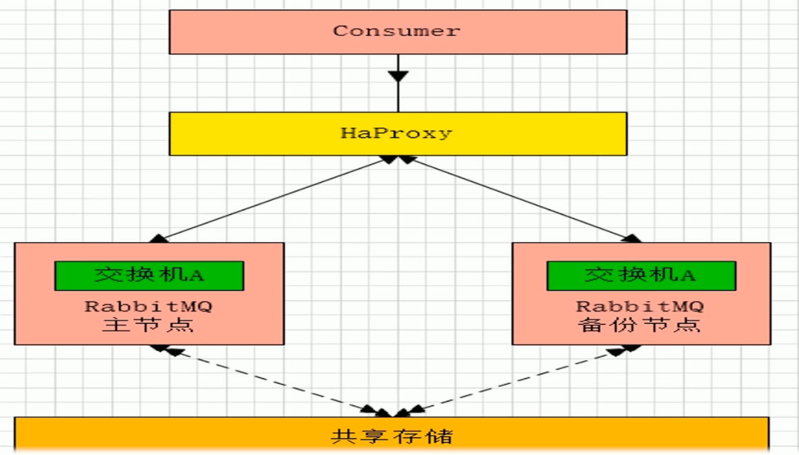

### 远程模式

> 远程模式可以实现双活的一种模式, 简称Shovel模式, 所谓Shovel就是我们可以把消息进行不同数据中心的复制工作, 可以跨地域的让两个MQ集群互联

 模式.png)

**Shovel模式拓扑图:**

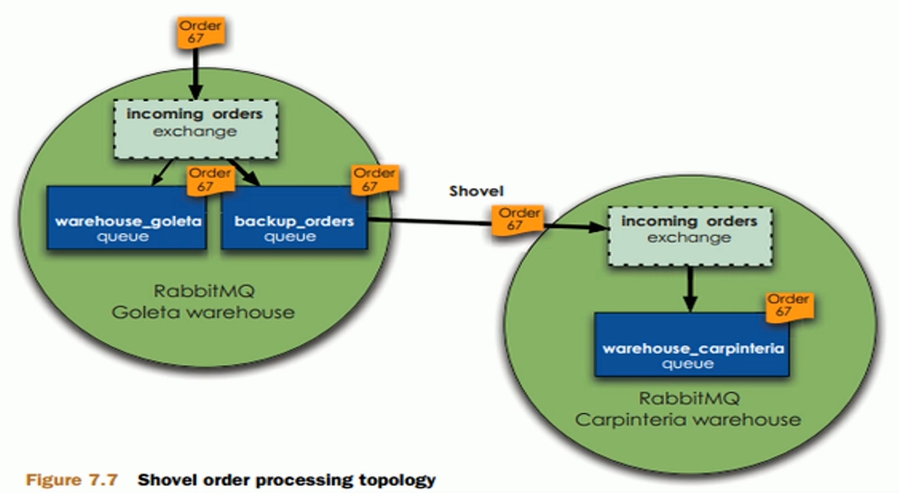

1. Shovel集群的配置, 首先需要启动RabbitMQ插件, 命令如下:

   > - rabbitmq-plugins enable amqp_client
   > - rabbitmq-plugins enable rabbitmq_shovel

2. 创建rabbitmq.config文件 : touch /etc/rabbitmq/rabbitmq.config
3. 源服务器和目标服务器都使用相同的配置文件(rabbitmq.config)

### 镜像模式

> - 集群中非常经典的就是Mirror镜像模式, 保证100%数据不丢失, 在实际工作中也是使用最多的。集群实现很简单
> - Mirror镜像队列, 目的是为了保证rabbitmq数据的高可靠性解决方案, 主要就是实现数据的同步, 一般来讲是2-3个节点实现数据同步(对于100%数据可靠性解决方案一般是3节点)

**架构如下:**

.png)

- 上面的SpringBoot Application表示应用, 实际不一定是SpringBoot的

### 多活模式

> 是实现异地数据复制的主流模式, 因为Shovel模式配置比较复杂, 所以一般来说实现异地集群都是使用这种双活或者多活模式来实现的。这种模式需要依赖rabbitmq的federation插件, 可以实现持续的可靠的AMQP数据通信, 多活模式配置与应用都很简单

- RabbitMQ部署架构采用双中心模式(多中心), 在两套(或多套)数据中心各部署一套RabbitMQ集群, 各中心的RabbitMQ服务除了需要为业务提供正常的消息服务外, 中心之间还需要实现部分队列消息共享。多活模式集群架构如下 :

  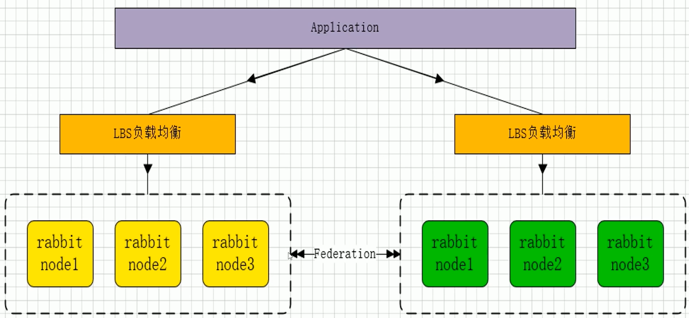

- Federation插件是一个不需要构建Cluster, 而在Broker之间传输消息的高性能插件, Federation插件可以在Broker或者Cluster之间传输消息, 连接的双方可以使用不同的users和virtual hosts, 双方也可以使用不同版本的RabbitMQ和Erlang。Federation插件使用AMQP协议通讯, 可以接受不连续的传输

- Federation Exchanges, 可以看成Downstream从Upsteam主动拉取消息, 但并不是拉取所有消息, 必须是在Downstream上已经明确定义Bindings关系的Exchange, 也就是有实际的物理Queue来接收消息, 才会从Upstream拉取消息到Downstream。使用AMQP协议实施代理间通讯, Downstream会将绑定关系组合在一起, 绑定/解除绑定命令发送到Upstream交换机。因此, Federation Exchange只接收具有订阅的消息, 

  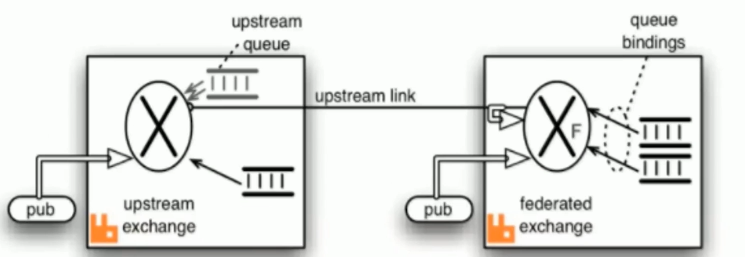

## 镜像模式集群搭建

### 准备三台RabbitMQ节点, 下面是我本地的三台虚拟机

| IP                  | hostname  |
| ------------------- | --------- |
| 192.168.72.138:5672 | rabbit138 |
| 192.168.72.139:5672 | rabbit139 |
| 192.168.72.140:5672 | rabbit140 |

### 选取任意一个节点作为master节点, 进行文件同步, 我这里选择138作为master节点

> - 将138主机/var/lib/rabbitmq/.erlang.cookie文件同步到139,140主机对应目录下
> - .erlang.cookie权限是400, 可能无法操作, 可以将权限改成777去复制, 我这里虚拟机是克隆出来的, 所以同步的这一步就省略了

### 组成集群

1. 停止三个节点的MQ服务 : rabbitmqctl stop

2. 在三个节点执行命令 : rabbitmq-server -detached

3. slave加入集群操作(重新加入集群也是同样的操作, 以最开始的主节点作为加入节点)

   > **修改三台主机hosts:**
   >
   > vi /etc/hosts, 添加如下三行:
   >
   > 192.168.72.139 rabbit139
   > 192.168.72.138 rabbit138
   > 192.168.72.140 rabbit140
   >
   > **在139,140主机上执行如下命令:**
   >
   > rabbitmqctl stop_app
   >
   > rabbitmqctl join_cluster --ram rabbit@rabbit138
   >
   > rabbitmqctl start_app
   >
   > *ram表示以内存方式加入集群, 不写默认以磁盘方式加入集群*
   >
   > **移除集群节点命令:**
   >
   > 将要移除的节点先停止, 使用命令rabbitmqctl stop_app, 然后在其他节点执行如下命令:
   >
   > rabbitmqctl forget_cluster_node rabbit@rabbit139

4. 修改集群名称 : rabbitmqctl set_cluster_name rabbit-qiyexue

5. 查看集群状态 : rabbitmqctl cluster_status

6. 管控台界面, 任意一台主机的即可 : http://192.168.72.140:15672

### 配置镜像队列(设置镜像队列策略)

- rabbitmqctl set_policy ha-all "^" '{"ha-mode":"all"}'

  > **pattern** 是匹配队列名称的正则表达式 , 进行区分哪些队列使用哪些策略
  >
  > **definition** 其实就是一些arguments, 支持如下参数：
  >
  > 1. `**ha-mode**：`One of `all`, `exactly` or `nodes` (the latter currently not supported by web UI).
  > 2. `**ha-params**：`Absent if `ha-mode` is `all`, a number if `ha-mode` is `exactly`, or an array of strings if `ha-mode` is `nodes`.
  > 3. `**ha-sync-mode**：`One of `manual` or `automatic`. *//如果不指定该参数默认为manual,这个在高可用集群测试的时候详细分析* 
  > 4. `**federation-upstream-set**：`A string; only if the federation plugin is enabled.
  >
  > **ha-mode** 的参数：
  >
  > | ha-mode | ha-params    | Result                                                       |
  > | ------- | ------------ | ------------------------------------------------------------ |
  > | all     | (absent)     | Queue is mirrored across all nodes in the cluster. When a new node is added to the cluster, the queue will be mirrored to that node. |
  > | exactly | *count*      | Queue is mirrored to *count* nodes in the cluster. If there are less than *count* nodes in the cluster, the queue is mirrored to all nodes. If there are more than *count*nodes in the cluster, and a node containing a mirror goes down, then a new mirror will not be created on another node. (This is to prevent queues migrating across a cluster as it is brought down.) |
  > | nodes   | *node names* | Queue is mirrored to the nodes listed in *node names*. If any of those node names are not a part of the cluster, this does not constitute an error. If none of the nodes in the list are online at the time when the queue is declared then the queue will be created on the node that the declaring client is connected to. |

- 将所有队列设置为镜像队列，即队列会被复制到各个节点，各个节点状态一致，RabbitMQ高可用集群就已经搭建好了,我们可以重启服务，查看其队列是否在从节点同步。

**至此, RabbitMQ镜像模式集群就已经搭建完成了**

### 集群配置参数详解

**配置文件如下:**

```json
{application, rabbit,           %% -*- erlang -*-
 [{description, "RabbitMQ"},
  {id, "RabbitMQ"},
  {vsn, "3.6.5"},
  {modules, ['background_gc','delegate','delegate_sup','dtree','file_handle_cache','file_handle_cache_stats','gatherer','gm','lqueue','mirrored_supervisor_sups','mnesia_sync','mochinum','pg2_fixed','pg_local','rabbit','rabbit_access_control','rabbit_alarm','rabbit_amqqueue_process','rabbit_amqqueue_sup','rabbit_amqqueue_sup_sup','rabbit_auth_mechanism_amqplain','rabbit_auth_mechanism_cr_demo','rabbit_auth_mechanism_plain','rabbit_autoheal','rabbit_binding','rabbit_boot_steps','rabbit_channel_sup','rabbit_channel_sup_sup','rabbit_cli','rabbit_client_sup','rabbit_connection_helper_sup','rabbit_connection_sup','rabbit_control_main','rabbit_ctl_usage','rabbit_dead_letter','rabbit_diagnostics','rabbit_direct','rabbit_disk_monitor','rabbit_epmd_monitor','rabbit_error_logger','rabbit_error_logger_file_h','rabbit_exchange','rabbit_exchange_parameters','rabbit_exchange_type_direct','rabbit_exchange_type_fanout','rabbit_exchange_type_headers','rabbit_exchange_type_invalid','rabbit_exchange_type_topic','rabbit_file','rabbit_framing','rabbit_guid','rabbit_hipe','rabbit_limiter','rabbit_log','rabbit_memory_monitor','rabbit_mirror_queue_coordinator','rabbit_mirror_queue_master','rabbit_mirror_queue_misc','rabbit_mirror_queue_mode','rabbit_mirror_queue_mode_all','rabbit_mirror_queue_mode_exactly','rabbit_mirror_queue_mode_nodes','rabbit_mirror_queue_slave','rabbit_mirror_queue_sync','rabbit_mnesia','rabbit_mnesia_rename','rabbit_msg_file','rabbit_msg_store','rabbit_msg_store_ets_index','rabbit_msg_store_gc','rabbit_node_monitor','rabbit_parameter_validation','rabbit_password','rabbit_password_hashing_md5','rabbit_password_hashing_sha256','rabbit_password_hashing_sha512','rabbit_plugins','rabbit_plugins_main','rabbit_plugins_usage','rabbit_policies','rabbit_policy','rabbit_prelaunch','rabbit_prequeue','rabbit_priority_queue','rabbit_queue_consumers','rabbit_queue_index','rabbit_queue_location_client_local','rabbit_queue_location_min_masters','rabbit_queue_location_random','rabbit_queue_location_validator','rabbit_queue_master_location_misc','rabbit_recovery_terms','rabbit_registry','rabbit_resource_monitor_misc','rabbit_restartable_sup','rabbit_router','rabbit_runtime_parameters','rabbit_sasl_report_file_h','rabbit_ssl','rabbit_sup','rabbit_table','rabbit_trace','rabbit_upgrade','rabbit_upgrade_functions','rabbit_variable_queue','rabbit_version','rabbit_vhost','rabbit_vm','supervised_lifecycle','tcp_listener','tcp_listener_sup','truncate','vm_memory_monitor','worker_pool','worker_pool_sup','worker_pool_worker']},
  {registered, [rabbit_amqqueue_sup,
                rabbit_log,
                rabbit_node_monitor,
                rabbit_router,
                rabbit_sup,
                rabbit_direct_client_sup]},
  {applications, [kernel, stdlib, sasl, mnesia, rabbit_common, ranch, os_mon, xmerl]},
%% we also depend on crypto, public_key and ssl but they shouldn't be
%% in here as we don't actually want to start it
  {mod, {rabbit, []}},
  {env, [{tcp_listeners, [5672]},
         {num_tcp_acceptors, 10},
         {ssl_listeners, []},
         {num_ssl_acceptors, 1},
         {ssl_options, []},
         {vm_memory_high_watermark, 0.4},
         {vm_memory_high_watermark_paging_ratio, 0.5},
         {memory_monitor_interval, 2500},
         {disk_free_limit, 50000000}, %% 50MB
         {msg_store_index_module, rabbit_msg_store_ets_index},
         {backing_queue_module, rabbit_variable_queue},
         %% 0 ("no limit") would make a better default, but that
         %% breaks the QPid Java client
         {frame_max, 131072},
         {channel_max, 0},
         {heartbeat, 60},
         {msg_store_file_size_limit, 16777216},
         {fhc_write_buffering, true},
         {fhc_read_buffering, false},
         {queue_index_max_journal_entries, 32768},
         {queue_index_embed_msgs_below, 4096},
         {default_user, <<"guest">>},
         {default_pass, <<"guest">>},
         {default_user_tags, [administrator]},
         {default_vhost, <<"/">>},
         {default_permissions, [<<".*">>, <<".*">>, <<".*">>]},
         {loopback_users, ["guest"]},
         {password_hashing_module, rabbit_password_hashing_sha256},
         {cluster_nodes, {[], disc}},
         {server_properties, []},
         {collect_statistics, none},
         {collect_statistics_interval, 5000},
         {mnesia_table_loading_timeout, 30000},
         {auth_mechanisms, ['PLAIN', 'AMQPLAIN']},
         {auth_backends, [rabbit_auth_backend_internal]},
         {delegate_count, 16},
         {trace_vhosts, []},
         {log_levels, [{connection, info}]},
         {ssl_cert_login_from, distinguished_name},
         {ssl_handshake_timeout, 5000},
         {ssl_allow_poodle_attack, false},
         {handshake_timeout, 10000},
         {reverse_dns_lookups, false},
         {cluster_partition_handling, ignore},
         {cluster_keepalive_interval, 10000},
         {tcp_listen_options, [{backlog,       128},
                               {nodelay,       true},
                               {linger,        {true, 0}},
                               {exit_on_close, false}]},
         {halt_on_upgrade_failure, true},
         {hipe_compile, false},
         %% see bug 24513 for how this list was created
         {hipe_modules,
          [rabbit_reader, rabbit_channel, gen_server2, rabbit_exchange,
           rabbit_command_assembler, rabbit_framing_amqp_0_9_1, rabbit_basic,
           rabbit_event, lists, queue, priority_queue, rabbit_router,
           rabbit_trace, rabbit_misc, rabbit_binary_parser,
           rabbit_exchange_type_direct, rabbit_guid, rabbit_net,
           rabbit_amqqueue_process, rabbit_variable_queue,
           rabbit_binary_generator, rabbit_writer, delegate, gb_sets, lqueue,
           sets, orddict, rabbit_amqqueue, rabbit_limiter, gb_trees,
           rabbit_queue_index, rabbit_exchange_decorator, gen, dict, ordsets,
           file_handle_cache, rabbit_msg_store, array,
           rabbit_msg_store_ets_index, rabbit_msg_file,
           rabbit_exchange_type_fanout, rabbit_exchange_type_topic, mnesia,
           mnesia_lib, rpc, mnesia_tm, qlc, sofs, proplists, credit_flow,
           pmon, ssl_connection, tls_connection, ssl_record, tls_record,
           gen_fsm, ssl]},
         {ssl_apps, [asn1, crypto, public_key, ssl]},
         %% see rabbitmq-server#114
         {mirroring_flow_control, true},
         {mirroring_sync_batch_size, 4096},
         %% see rabbitmq-server#227 and related tickets.
         %% msg_store_credit_disc_bound only takes effect when
         %% messages are persisted to the message store. If messages
         %% are embedded on the queue index, then modifying this
         %% setting has no effect because credit_flow is not used when
         %% writing to the queue index. See the setting
         %% queue_index_embed_msgs_below above.
         {msg_store_credit_disc_bound, {2000, 500}},
         {msg_store_io_batch_size, 2048},
         %% see rabbitmq-server#143
         {credit_flow_default_credit, {200, 50}},
         %% see rabbitmq-server#248
         %% and rabbitmq-server#667
         {channel_operation_timeout, 15000}
        ]}]}.
```

**主要配置参数:**

**官网地址 :** http://www.rabbitmq.com/configure.html

| **Key**                                   | **Documentation**                                            |
| ----------------------------------------- | ------------------------------------------------------------ |
| **tcp_listeners**                         | 用于监听 AMQP连接的端口列表(无SSL). 可以包含整数 (即"监听所有接口")或者元组如 {"127.0.0.1", 5672} 用于监听一个或多个接口.Default: [5672] |
| num_tcp_acceptors                         | 接受TCP侦听器连接的Erlang进程数。Default: 10                 |
| handshake_timeout                         | AMQP 0-8/0-9/0-9-1 handshake (在 socket连接和SSL 握手之后）的最大时间, 毫秒为单位.Default: 10000 |
| ssl_listeners                             | 如上所述，用于SSL连接。Default: []                           |
| num_ssl_acceptors                         | 接受SSL侦听器连接的Erlang进程数。Default: 1                  |
| ssl_options                               | SSL配置.参考[**SSL documentation**](http://www.rabbitmq.com/ssl.html#enabling-ssl).Default: [] |
| ssl_handshake_timeout                     | SSL handshake超时时间,毫秒为单位.Default: 5000               |
| **vm_memory_high_watermark**              | 流程控制触发的内存阀值．相看[**memory-based flow control**](http://www.rabbitmq.com/memory.html) 文档.Default: 0.4 |
| **vm_memory_high_watermark_paging_ratio** | 高水位限制的分数，当达到阀值时，队列中消息消息会转移到磁盘上以释放内存. 参考[**memory-based flow control**](http://www.rabbitmq.com/memory.html) 文档.Default: 0.5 |
| **disk_free_limit**                       | RabbitMQ存储数据分区的可用磁盘空间限制．当可用空间值低于阀值时，流程控制将被触发.此值可根据RAM的总大小来相对设置 (如.{mem_relative, 1.0}).此值也可以设为整数(单位为bytes)或者使用数字单位(如．"50MB").默认情况下，可用磁盘空间必须超过50MB.参考 [**Disk Alarms**](http://www.rabbitmq.com/disk-alarms.html) 文档.Default: 50000000 |
| log_levels                                | 控制日志的粒度.其值是日志事件类别(category)和日志级别(level)成对的列表．level 可以是 'none' (不记录日志事件), 'error' (只记录错误), 'warning' (只记录错误和警告), 'info' (记录错误，警告和信息), or 'debug' (记录错误，警告，信息以及调试信息).目前定义了４种日志类别. 它们是：channel -针对所有与AMQP channels相关的事件connection - 针对所有与网络连接相关的事件federation - 针对所有与[**federation**](http://www.rabbitmq.com/federation.html)相关的事件mirroring -针对所有与 [**mirrored queues**](http://www.rabbitmq.com/ha.html)相关的事件Default: [{connection, info}] |
| frame_max                                 | 与客户端协商的允许最大frame大小. 设置为０表示无限制，但在某些QPid客户端会引发bug. 设置较大的值可以提高吞吐量;设置一个较小的值可能会提高延迟.  Default: 131072 |
| channel_max                               | 与客户端协商的允许最大chanel大小. 设置为０表示无限制．该数值越大，则broker使用的内存就越高．Default: 0 |
| channel_operation_timeout                 | Channel 操作超时时间(毫秒为单位） (内部使用，因为消息协议的区别和限制，不暴露给客户端).Default: 5000 |
| heartbeat                                 | 表示心跳延迟(单位为秒) ，服务器将在connection.tune frame中发送.如果设置为 0, 心跳将被禁用. 客户端可以不用遵循服务器的建议, 查看 [**AMQP reference**](http://www.rabbitmq.com/amqp-0-9-1-reference.html#connection.tune) 来了解详情. 禁用心跳可以在有大量连接的场景中提高性能，但可能会造成关闭了非活动连接的网络设备上的连接落下．Default: 60 (3.5.5之前的版本是580) |
| default_vhost                             | 当RabbitMQ从头开始创建数据库时创建的虚拟主机. amq.rabbitmq.log交换器会存在于这个虚拟主机中.Default: <<"/">> |
| default_user                              | RabbitMQ从头开始创建数据库时，创建的用户名.Default: <<"guest">> |
| default_pass                              | 默认用户的密码.Default: <<"guest">>                          |
| default_user_tags                         | 默认用户的Tags.Default: [administrator]                      |
| default_permissions                       | 创建用户时分配给它的默认[**Permissions**](http://www.rabbitmq.com/access-control.html) .Default: [<<".*">>, <<".*">>, <<".*">>] |
| loopback_users                            | 只能通过环回接口(即localhost)连接broker的用户列表如果你希望默认的guest用户能远程连接,你必须将其修改为[].Default: [<<"guest">>] |
| cluster_nodes                             | 当节点第一次启动的时候，设置此选项会导致集群动作自动发生. 元组的第一个元素是其它节点想与其建立集群的节点. 第二个元素是节点的类型，要么是disc,要么是ramDefault: {[], disc} |
| server_properties                         | 连接时向客户端声明的键值对列表Default: []                    |
| collect_statistics                        | 统计收集模式。主要与管理插件相关。选项：none (不发出统计事件)coarse (发出每个队列 /每个通道 /每个连接的统计事件)fine (也发出每个消息统计事件)你自已可不用修改此选项.Default: none |
| collect_statistics_interval               | 统计收集时间间隔(毫秒为单位)． 主要针对于 [**management plugin**](http://www.rabbitmq.com/management.html#statistics-interval).Default: 5000 |
| auth_mechanisms                           | 提供给客户端的[**SASL authentication mechanisms**](http://www.rabbitmq.com/authentication.html).Default: ['PLAIN', 'AMQPLAIN'] |
| auth_backends                             | 用于 [**authentication / authorisation backends**](http://www.rabbitmq.com/access-control.html) 的列表. 此列表可包含模块的名称(在模块相同的情况下，将同时用于认证来授权)或像{ModN, ModZ}这样的元组，在这里ModN将用于认证，ModZ将用于授权.在２元组的情况中, ModZ可由列表代替,列表中的所有元素必须通过每个授权的确认，如{ModN, [ModZ1, ModZ2]}.这就允许授权插件进行组合提供额外的安全约束.除rabbit_auth_backend_internal外，其它数据库可以通常 [**plugins**](http://www.rabbitmq.com/plugins.html)来使用.Default: [rabbit_auth_backend_internal] |
| reverse_dns_lookups                       | 设置为true,可让客户端在连接时让RabbitMQ 执行一个反向DNS查找, 然后通过 rabbitmqctl 和 管理插件来展现信息.  Default: false |
| delegate_count                            | 内部集群通信中，委派进程的数目. 在一个有非常多核的机器(集群的一部分)上,你可以增加此值.Default: 16 |
| trace_vhosts                              | [**tracer**](http://www.rabbitmq.com/firehose.html)内部使用.你不应该修改.Default: [] |
| tcp_listen_options                        | 默认socket选项. 你可能不想修改这个选项.Default:[{backlog,       128},          {nodelay,       true},          {exit_on_close, false}] |
| **hipe_compile**                          | 将此选项设置为true,将会使用HiPE预编译部分RabbitMQ,Erlang的即时编译器. 这可以增加服务器吞吐量，但会增加服务器的启动时间． 你可以看到花费几分钟延迟启动的成本，就可以带来20-50% 更好性能.这些数字与高度依赖于工作负载和硬件．HiPE 支持可能没有编译进你的Erlang安装中.如果没有的话，启用这个选项,并启动RabbitMQ时，会看到警告消息． 例如, Debian / Ubuntu 用户需要安装erlang-base-hipe 包.HiPE并非在所有平台上都可用,尤其是Windows.在 Erlang/OTP 1７.５版本之前，HiPE有明显的问题 . 对于HiPE,使用最新的OTP版本是高度推荐的．Default: false |
| cluster_partition_handling                | 如何处理网络分区.可用模式有:ignorepause_minority{pause_if_all_down, [nodes], ignore \| autoheal}where [nodes] is a list of node names (ex: ['rabbit@node1', 'rabbit@node2'])autoheal参考[**documentation on partitions**](http://www.rabbitmq.com/partitions.html#automatic-handling) 来了解更多信息Default: ignore |
| cluster_keepalive_interval                | 节点向其它节点发送存活消息和频率(毫秒). 注意，这与 **net_ticktime是不同的**;丢失存活消息不会引起节点掉线Default: 10000 |
| queue_index_embed_msgs_below              | 消息大小在此之下的会直接内嵌在队列索引中. 在修改此值时，建议你先阅读　 [**persister tuning**](http://www.rabbitmq.com/persistence-conf.html) 文档.Default: 4096 |
| msg_store_index_module                    | 队列索引的实现模块. 在修改此值时，建议你先阅读　 [**persister tuning**](http://www.rabbitmq.com/persistence-conf.html) 文档.Default: rabbit_msg_store_ets_index |
| backing_queue_module                      | 队列内容的实现模块. 你可能不想修改此值．Default: rabbit_variable_queue |
| msg_store_file_size_limit                 | Tunable value for the persister. 你几乎肯定不应该改变此值。Default: 16777216 |
| mnesia_table_loading_timeout              | 在集群中等待使用Mnesia表可用的超时时间。Default: 30000       |
| queue_index_max_ journal_entries          | Tunable value for the persister. 你几乎肯定不应该改变此值。Default: 65536 |
| queue_master_locator                      | Queue master 位置策略.可用策略有:<<"min-masters">><<"client-local">><<"random">>查看[**documentation on queue master location**](http://www.rabbitmq.com/ha.html#queue-master-location) 来了解更多信息．Default: <<"client-local">> |

### HaProxy

#### HaProxy简介

> HAProxy是一款提供高可用性、负载均衡以及基于TCP(第四层)和HTTP(第七层)应用的代理软件，支持虚拟主机, HAProxy是完全免费的、借助HAProxy可以快速并且可靠的提供基于TCP和HTTP应用的代理解决方案。
>
> HAProxy适用于那些负载较大的web站点，这些站点通常又需要会话保持或七层处理。 
>
> HAProxy可以支持数以万计的并发连接,并且HAProxy的运行模式使得它可以很简单安全的整合进架构中，同时可以保护web服务器不被暴露到网络上。

**HaProxy借助于OS(操作系统)上几种常见的技术来实现性能的最大化 :**

1. 单进程, 事件驱动模型显著降低了上下文切换的开销及内存占用
2. 在任何可用的情况下, 单缓冲(single buffering)机制能以不复制任何数据的方式完成读写操作, 这会节约大量的CPU时钟周期及内存带宽
3. 借助于Linux2.6(>=2.6.27.19)上的splice()系统调用, HaProxy可以实现零复制转发(Zero-copy fowarding), 在Linux3.5及以上的OS中还可以实现零复制启动(zero-starting)
4. 内存分配器固定大小的内存池中可实现即时内存分配,  这能显著减少创建一个会话的时长
5. 树形存储 : 侧重于使用作者多年前开发的弹性二叉树, 实现了以O(logn)的低开销来保持计时器命令, 保持运行队列命令及管理轮询以及最少连接队列

#### HaProxy安装

这里准备了两台虚拟机,192.168.72.141/142, 两台虚拟机都使用同样步骤进行安装

```shell
// 下载依赖包
yum install gcc vim wget
// 下载haproxy
wget https://www.haproxy.org/download/1.6/src/haproxy-1.6.5.tar.gz
// 解压
tar -zxvf haproxy-1.6.5.tar.gz -C /usr/local
// 进入目录、进行编译、安装
cd /usr/local/haproxy-1.6.5
make TARGET=linux31 PREFIX=/usr/local/haproxy
make install PREFIX=/usr/local/haproxy
mkdir /etc/haproxy
// 赋权
groupadd -r -g 149 haproxy
useradd -g haproxy -r -s /sbin/nologin -u 149 haproxy
// 创建haproxy配置文件
touch /etc/haproxy/haproxy.cfg

```

#### HaProxy配置

vim /etc/haproxy/haproxy.cfg

```yml
#logging options
global
	log 127.0.0.1 local0 info
	maxconn 5120
	chroot /usr/local/haproxy
	uid 99
	gid 99
	daemon
	quiet
	nbproc 20
	pidfile /var/run/haproxy.pid

defaults
	log global
	#使用4层代理模式，”mode http”为7层代理模式
	mode tcp
	#if you set mode to tcp,then you nust change tcplog into httplog
	option tcplog
	option dontlognull
	retries 3
	option redispatch
	maxconn 2000
	contimeout 5s
     ##客户端空闲超时时间为 60秒 则HA 发起重连机制
     clitimeout 60s
     ##服务器端链接超时时间为 15秒 则HA 发起重连机制
     srvtimeout 15s	
#front-end IP for consumers and producters

listen rabbitmq_cluster
	bind 0.0.0.0:5672
	#配置TCP模式
	mode tcp
	#balance url_param userid
	#balance url_param session_id check_post 64
	#balance hdr(User-Agent)
	#balance hdr(host)
	#balance hdr(Host) use_domain_only
	#balance rdp-cookie
	#balance leastconn
	#balance source //ip
	#简单的轮询
	balance roundrobin
	#rabbitmq集群节点配置 #inter 每隔五秒对mq集群做健康检查， 2次正确证明服务器可用，2次失败证明服务器不可用，并且配置主备机制
        server rabbit138 192.168.72.138:5672 check inter 5000 rise 2 fall 2
        server rabbit139 192.168.72.139:5672 check inter 5000 rise 2 fall 2
        server rabbit140 192.168.72.140:5672 check inter 5000 rise 2 fall 2
#配置haproxy web监控，查看统计信息
listen stats
	# 142主机就配置成142
	bind 192.168.72.141:8100
	mode http
	option httplog
	stats enable
	#设置haproxy监控地址为http://localhost:8100/rabbitmq-stats
	stats uri /rabbitmq-stats
	stats refresh 5s

```

#### 启动HaProxy

> /usr/local/haproxy/sbin/haproxy -f /etc/haproxy/haproxy.cfg
>
> // 查看haproxy进程状态
>
> ps -ef | grep haproxy

**控制台访问地址 :** http://192.168.72.141/142:8100/rabbitmq-stats

### Keepalived

#### Keepalived简介

- 基于VRRP协议来实现高可用性（HA）, 主要来防止服务器单点故障的发生问题

- VRRP（Virtual Router Redundancy Protocol）虚拟路由器冗余协议, VRRP协议将两台或多台路由器设备虚拟成一个设备，对外提供虚拟路由器IP（一个或多个）。它能保证当个别节点宕机时, 整个网络可以不间断的运行。

- 可以通过其与Nginx、Haproxy等反向代理的负载均衡服务器配合实现web服务端的高可用

- Keepalived的三个重要功能:

  > - 具有配置管理LVS负载均衡软件
  > - 实现LVS集群节点的健康检查功能
  > - 实现系统网络的高可用(failover)功能

**Keepalived高可用原理**

Keepalived高可用服务之间的故障转移切换, 是通过VRRP协议来实现的。在Keepalived服务正常工作时, Master接待会不断的向slave节点发送心跳消息, 用于告诉从Backup节点自己还活着, 当Master节点发生故障时, 就无法发送心跳消息, 从节点就因此无法继续监测到来自Master节点的心跳了, 于是调用自身的接管程序, 接管Master节点的IP资源及服务。当Master节点恢复时, 从节点又会释放主节点故障时自身接管的IP资源及服务, 恢复到原来的备用角色

#### Keepalived安装

1. 这里Keepalived安装的机器和的HaProxy安装在同样的机器上面, 192.168.72.141/142

2. 安装所需软件包

   > yum install -y openssl openssl-devel

3. 下载Keepalived, 下载地址 :http://www.keepalived.org/download.html

   > wget http://www.keepalived.org/software/keepalived-1.2.18.tar.gz

4. 解压、编译、安装

   > tar -zxvf keepalived-1.2.18.tar.gz -C /usr/local/
   >
   > cd /usr/local/keepalived-1.2.18/ && ./configure --prefix=/usr/local/keepalived
   >
   > make && make install

4. 将keepalived安装成Linux系统服务，因为没有使用keepalived的默认安装路径（默认路径：/usr/local）,安装完成之后，需要做一些修改工作

   > **首先创建文件夹，将keepalived配置文件进行复制：**
   >
   > mkdir /etc/keepalived
   >
   > cp /usr/local/keepalived/etc/keepalived/keepalived.conf /etc/keepalived/
   >
   > **然后复制keepalived脚本文件：**
   >
   > cp /usr/local/keepalived/etc/rc.d/init.d/keepalived /etc/init.d/
   >
   > cp /usr/local/keepalived/etc/sysconfig/keepalived /etc/sysconfig/
   >
   > **创建软连接, 如果软连接存在就删除重建:**
   >
   > ln -s /usr/local/sbin/keepalived /usr/sbin/
   >
   > ln -s /usr/local/keepalived/sbin/keepalived /sbin/

5. 设置开机启动, 安装完毕

   > chkconfig keepalived on

6. 修改Keepalived配置, vim /etc/keepalived/keepalived.conf

   **141作为主节点, 配置如下:**

   ```yaml
   ! Configuration File for keepalived
   
   global_defs {
      router_id keepalived141  ##标识节点的字符串，通常为hostname
   
   }
   
   vrrp_script chk_haproxy {
       script "/etc/keepalived/haproxy_check.sh"  ##执行脚本位置
       interval 2  ##检测时间间隔
       weight -20  ##如果条件成立则权重减20
   }
   
   vrrp_instance VI_1 {
       state MASTER  ## 主节点为MASTER，备份节点为BACKUP
       interface ens33 ## 绑定虚拟IP的网络接口（网卡），与本机IP地址所在的网络接口相同（我这里是ens33）
       virtual_router_id 141  ## 虚拟路由ID号（主备节点一定要相同）
       mcast_src_ip 192.168.72.141 ## 本机ip地址
       priority 100  ##优先级配置（0-254的值）
       nopreempt
       advert_int 1  ## 组播信息发送间隔，俩个节点必须配置一致，默认1s
   authentication {  ## 认证匹配
           auth_type PASS
           auth_pass qiyexue
       }
   
       track_script {
           chk_haproxy
       }
   
       virtual_ipaddress {
           192.168.72.145  ## 虚拟ip，可以指定多个
       }
   ```

   **142作为从节点, 配置如下 :**

   ```yaml
   ! Configuration File for keepalived
   
   global_defs {
      router_id keepalived142  ##标识节点的字符串，通常为hostname
   
   }
   
   vrrp_script chk_haproxy {
       script "/etc/keepalived/haproxy_check.sh"  ##执行脚本位置
       interval 2  ##检测时间间隔
       weight -20  ##如果条件成立则权重减20
   }
   
   vrrp_instance VI_1 {
       state BACKUP  ## 主节点为MASTER，备份节点为BACKUP
       interface ens33 ## 绑定虚拟IP的网络接口（网卡），与本机IP地址所在的网络接口相同（我这里是ens33）
       virtual_router_id 141  ## 虚拟路由ID号（主备节点一定要相同）
       mcast_src_ip 192.168.72.142 ## 本机ip地址
       priority 90  ##优先级配置（0-254的值）
       nopreempt
       advert_int 1  ## 组播信息发送间隔，俩个节点必须配置一致，默认1s
   authentication {  ## 认证匹配
           auth_type PASS
           auth_pass qiyexue
       }
   
       track_script {
           chk_haproxy
       }
   
       virtual_ipaddress {
           192.168.72.145  ## 虚拟ip，可以指定多个
       }
   }
   ```

7. 检测脚本编写, 添加文件位置为/etc/keepalived/haproxy_check.sh(141, 142两个节点文件内容一致), 脚本内容如下:

   ```shell
   #!/bin/bash
   COUNT=`ps -C haproxy --no-header |wc -l`
   if [ $COUNT -eq 0 ];then
       /usr/local/haproxy/sbin/haproxy -f /etc/haproxy/haproxy.cfg
       sleep 2
       if [ `ps -C haproxy --no-header |wc -l` -eq 0 ];then
           killall keepalived
       fi
   fi
   ```

8. 执行脚本赋权(141,142同样操作)

   > chmod +x /etc/keepalived/haproxy_check.sh

9. 启动keepalived

   ```shell
   # 启动两台机器的keepalived
   # 四个命令对应 启动, 停止, 查看状态, 重启
   service keepalived start | stop | status | restart
   # 查看状态
   ps -ef | grep haproxy
   ps -ef | grep keepalived
   
   ```

11. 节点测试
    - 安装完成之后, 执行ip a看下两个主机ip, 发现VIP 145在主节点141上
    - 将141的keepalived停掉, 然后发现VIP 145浮动到了142上面
    - 将141再启起来, VIP 145又再次浮动到141上了

## 集群恢复与故障转移

前提 : A, B两个节点组成一个镜像队列, B是Master节点

### 场景一

- A先停, B后停
- 解决方案 : 该场景下B是Master, 只要先启动B, 在启动A即可。或者先启动A, 30秒之内启动B即可恢复镜像队列

### 场景二

- A, B同时停机
- 解决方案 : 只需要在30秒内连续启动A和B即可恢复镜像

### 场景三

- A先停, B后停, 且A无法恢复
- 解决场景 : 因为B是Master, 所以等B启起来以后, 在B节点上调用控制台命令 : **rabbitmqctl forget_cluster_node A**解除与A的Cluster关系, 再将新的Slave节点加入B即可重新恢复镜像队列

### 场景四

- A先停, B后停, 且B无法恢复
- 解决方案 : 因为Master节点无法恢复, 所以较难处理, 在3.4.2之前没有什么好的解决方案, 但是现在已经有解决方案了, 在3.4.2以后的版本。因为B是主节点, 所以直接启动A是不行的, 当A无法启动时, 也就没有办法在A节点上调用**rabbitmqctl forget_cluster_node B **命令了。但是在新版本中forget_cluster_node支持**--offline**参数, 支持线下移除节点。这就意味着运行rabbitmqctl在理想节点上执行命令, 迫使RabbitMQ在未启动Slave节点中选择一个节点作为Master。当在A节点执行**rabbitmqctl forget_cluster_node --offline B **时, RabbitMQ会mock一个节点代表A, 执行 **forget_cluster_node**命令将B移除cluster, 然后A就可以正常启动了, 最后将新的Slave节点加入A即可重新恢复镜像队列

**场景五**

- A先停, B后停, 且A, B均无法恢复, 但是能得到A或B的磁盘文件
- 解决方案 : 这种场景更加难以处理, 只能通过恢复数据的方式去尝试恢复, 将A或B的数据库文件默认在$RABBIT_HOME/var/lib目录中, 把它拷贝到新节点对应的目录下, 再将新节点的hostname改成A或B的hostname, 如果是A节点(Slave)的磁盘文件, 按照场景四处理即可, 如果是B节点(Master)的磁盘文件, 则按照场景三处理, 最后将新的Slave加入到新节点后完成恢复
- 这种场景很极端, 只能尝试恢复

### 场景六

- A,B均停机, A,B均无法恢复, 且A或B的磁盘文件都无法恢复
- 解决方案 : 凉凉, 无法解决

# 延迟插件

## 作用

- 消息的延迟推送
- 定时任务(消息)的执行
- 一些消息重试策略的配合使用
- 业务削峰限流
- 降级的异步延迟消息机制

## 安装

1. 下载插件

   > <http://www.rabbitmq.com/community-plugins.html>
   >
   > <https://bintray.com/rabbitmq/community-plugins/rabbitmq_delayed_message_exchange/v3.6.x#files/>

2. 将插件上传到主机

   > /usr/lib/rabbitmq/lib/rabbitmq_server-3.6.5/plugins

3. 启用插件

   > rabbitmq-plugins enable rabbitmq_delayed_message_exchange

# RabbitMQ-SET化架构

- 使用Federation插件进行不同集群的RabbitMQ节点之间进行通信
-  集群之间节点通信由集群保障, 这样就能在不同集群之间完成数据同步

# RabbitMQ-基础组件封装

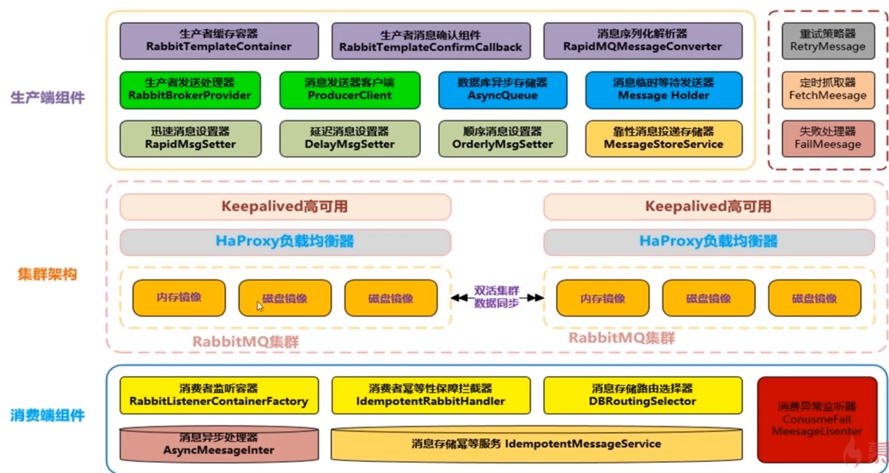

- 支持高性能的序列化转换, 异步化发送消息
- 支持消息生产实例与消费实例的链接池化缓存化, 提升性能
- 支持可靠性投递消息, 保障消息100%不丢失
- 支持消费端的幂等操作, 避免消费端重复消费的问题
- 支持迅速消息发送模式, 在一些日志收集/统计分析等需求下可以保证高性能, 高吞吐量
- 支持延迟消息模式, 消息可以延迟发送, 指定延迟时间, 用于某些延迟检查, 服务限流场景
- 支持事务消息, 器100%保障可靠性投递, 在金融行业单笔大金额操作时会有此类需求
- 支持顺序消息, 保证消息送达消费端的先后顺序
- 支持消息补偿, 重试, 以及快速定位异常/失败消息
- 支持集群消息负载均衡, 保障消息落到具体SET集群的负载均衡
- 支持消息路由策略, 指定某些消息路由到指定的SET集群

## 迅速消息发送

- 迅速消息是指消息不进行落库存储, 不做可靠性的保障
- 在一些非核心消息, 日志数据, 或者统计分析等场景下比较合适
- 迅速消息的优点就是性能最高, 吞吐量最大

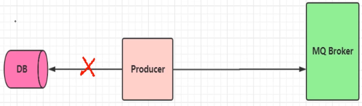

## 确认消息发送

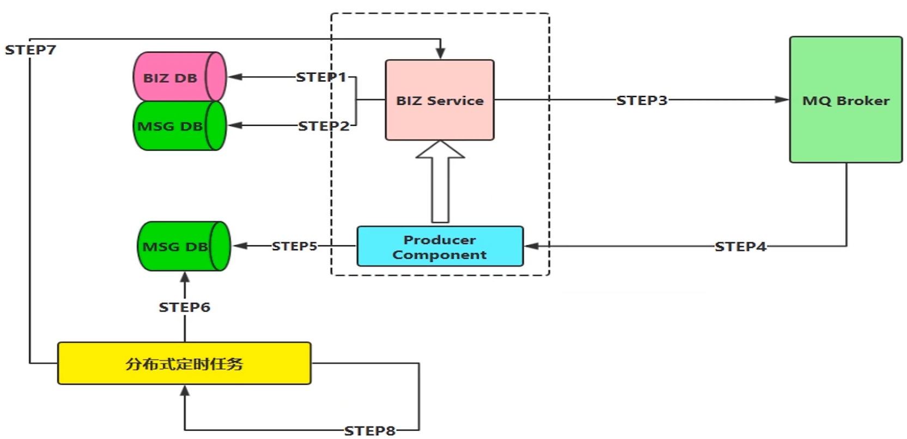

1. step1, step2 : 业务信息和消息信息入库
2. step3 : 消息发送到MQ Broker
3. step4 : Broker回送一个ACK确认消息
4. step5 : 更新DB中消息状态
5. step6 : 定时任务读取中间状态消息
6. step7 : 执行消息重发
7. step8 : 重发多次依旧失败的消息, 将其置为失败终态

## 批量消息发送

> 批量消息是指我们把消息放到一个集合里统一进行提交, 这种方案设计思路是期望消息在一个会话里, 比如投递到threadlocal里的集合, 然后拥有相同的会话ID, 并且带有这次提交消息的SIZE等相关相关属性, 最重要的一点是要把这一批消息进行合并。对于Channel而言, 就是发送一次消息。这种方式也是希望消费端在消费的时候, 可以进行批量化的消费, 针对于某一个原子业务的操作去处理, 但是不保障可靠性, 需要进行补偿机制。

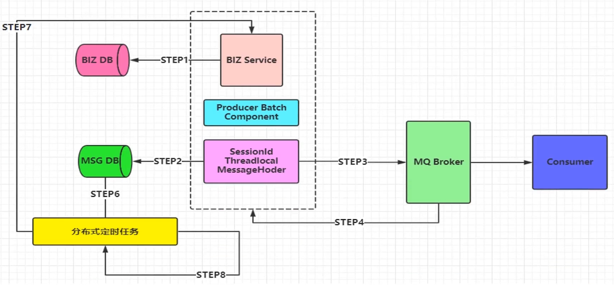

1. step1 : 业务数据入库
2. step2 : 消息组装之后进行统一入库(如果不需要可靠性投递的话, 可以省略)
3. step3 : 消息发送到Broker
4. step4-step8基本和确认消息是一致的,如果不需要可靠性投递的话, 是可以省略的

## 延迟消息发送

- 延迟消息就是在Message封装的时候, 添加delayTime属性即可, 使得我们的消息可以进行延迟发送

## 顺序消息发送

- 顺序消息有点类似于批量消息的实现机制, 但是有些不同, 顺序消息需要保障一下几点:

  1. 发送的顺序消息, 必须保障消息投递到同一个队列, 且这个消费者只能有一个(独占模式)
  2. 然后需要统一提交(可能是合并成一个大的消息, 也可能是拆分为多个消息), 并且所有消息的会话ID要一致
  3. 添加消息属性 : 顺序标记的序号, 和本次顺序消息的SIZE属性, 进行落库操作
  4. 并行进行发送给自身的延迟消息(带上关键属性 : **会话ID, SIZE**)进行后续处理消费
  5. 当收到延迟消息后, 根据会话**ID, SIZE**抽取数据库数据进行处理即可
  6. 定时轮询补偿机制, 对于异常情况(如生产端消息没有完全投递成功或者消费端落库异常导致消费端落库后缺少消息条目的情况)进行补偿

  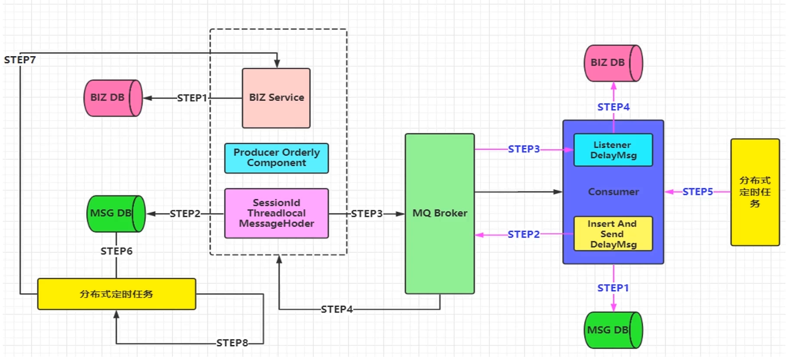

## 事务消息发送

- 事务消息, 使用相对较少
- 为了保障性能的同时, 也支持事务。并不推荐选择传统的RabbitMQ事务和Spring集成的机制, 因为在性能测试过程中, 这种方式性能并不理想, 非常消耗系统资源, 且会出现阻塞等情况, 高峰期也是一定程度上影响MQ集群的性能
- 解决方案 : 采用类似可靠性投递的机制, 也就是补偿机制。但是数据源必须是同一个, 也就是业务操作的数据库DB1和消息记录的数据库DB2使用同一个数据库, 保证DB层的数据一致性
- 然后利用重写Spring DataSourceTransactionManager, 在本地事务提交的时候进行发送消息, 但是也有可能事务提交成功但是消息发送失败, 这个时候就需要进行补偿了。

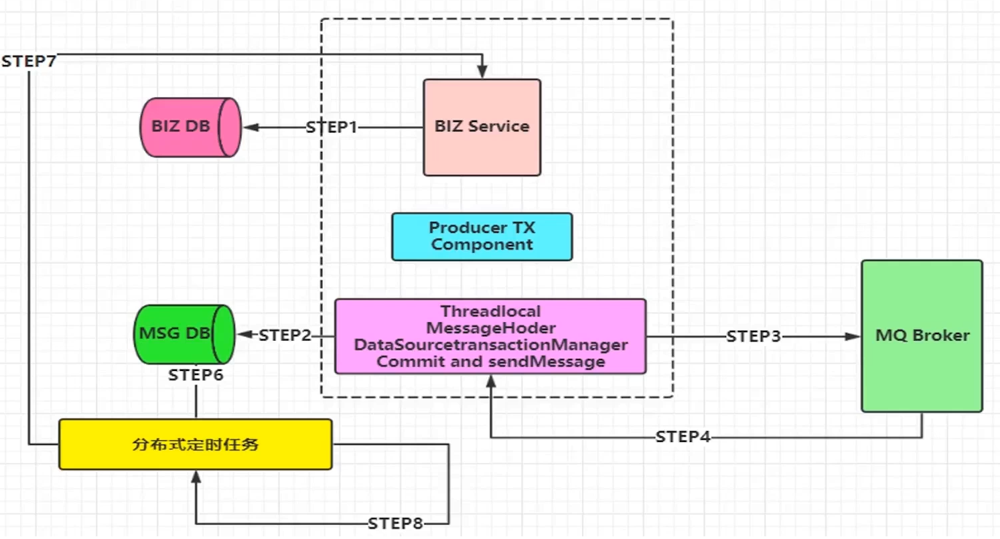

## 消息幂等性保障-消息路由规则架构设计

**可能导致消息出现非幂等性的原因 :** 

- 可靠性消息投递机制造成的消息重发
- MQ Broker服务于消费端消息传输的过程中出现网络抖动
- 消费端故障或异常

**消息幂等性设计 :**

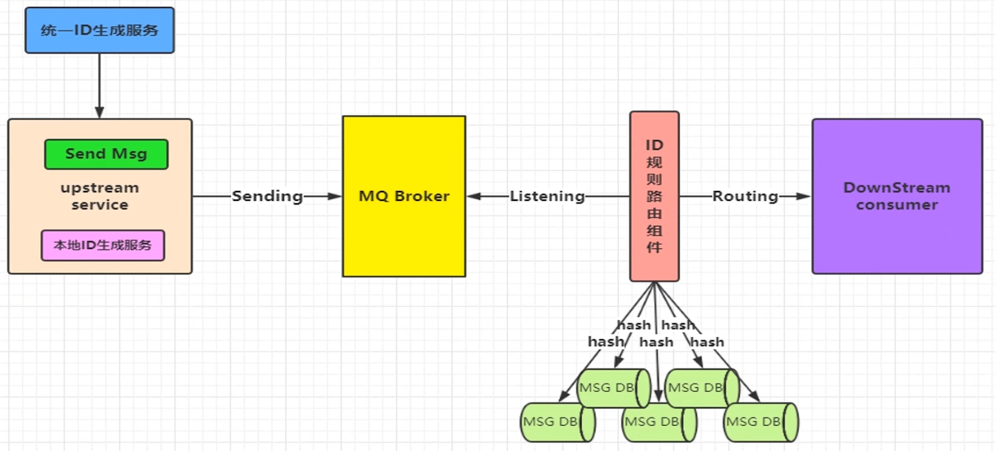